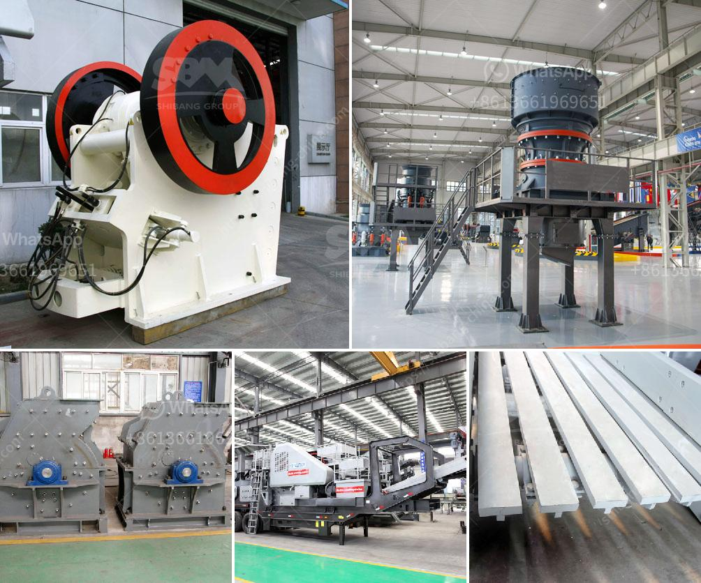

<h3>gypsum crushing machine</h3>
Gypsum is a common mineral found around the world and is used in various industrial applications. It is primarily used as a raw material in the production of gypsum boards and plasters. However, before it can be used in these applications, it must be crushed and processed to a fine powder.

One of the key pieces of equipment used in this process is the gypsum crushing machine. It is widely used in various industrial fields, including cement, construction, mining, and chemical industries. The machine is specifically designed to produce uniform-sized particles by reducing large rocks or stones into smaller pieces.

The primary step in the gypsum crushing process is to break the large material into small particle size by jaw crusher. A jaw crusher is a type of primary crusher used in gypsum crushing plants. The working principle of this machine is to move back and forth, up and down the jaws to crush the raw gypsum into the desired size range. It is important to note that different jaw crushers have different capacities and output sizes, so it is crucial to choose the right machine for the job.

Once the gypsum is crushed into the desired size, it is then transported to a secondary crusher. This crusher further reduces the size of the gypsum to a more manageable size that can be handled by other equipment such as screens and conveyors. There are various types of secondary crushers that can be used in this stage, including impact crushers and cone crushers. These crushers further refine the gypsum and ensure that it meets the desired specifications.

After the crushing process, the gypsum is then screened to remove any impurities and ensure it is of high quality. This is done using vibrating screens that separate the gypsum particles into different sizes. The fine particles are then collected and sent to storage silos or transported directly to the next stage of the manufacturing process.

In addition to the crushing process, gypsum crushing machines also play a crucial role in the drying process. In order to remove the excess moisture, gypsum needs to be heated in a specific drying system. This is typically done using rotary dryers or fluid bed dryers, which produce a constant flow of hot air that effectively removes the moisture from the gypsum.

Overall, gypsum crushing machines are essential in the gypsum manufacturing process as they help transform raw gypsum into a useable material. They reduce the size of the gypsum, ensure its purity, and prepare it for further processing. Without these machines, the production of gypsum boards and plasters would be significantly hindered.

In conclusion, gypsum crushing machines are vital in the production of gypsum products. They break down large gypsum rocks into smaller, more manageable pieces, ensuring the material meets the required specifications. Whether it is jaw crushers, impact crushers, or cone crushers, these machines play a crucial role in the gypsum manufacturing process and contribute to the quality and efficiency of the final product.
<h3>Contact us</h3><ul><li><strong>Whatsapp:&nbsp;<a href="https://wa.me/8613661969651">+8613661969651</a></strong></li><li><a href="https://swt.shibang-china.com/?git&amp;zhl&amp;gypsum crushing machine"><strong>Online Service(chat now)</strong></a></li></ul><h3>Related</h3><ul><li><a href='maintenance plan of crusher.md'>maintenance plan of crusher</a></li><li><a href='vibratory ball mill china.md'>vibratory ball mill china</a></li><li><a href='mineral processing plants china.md'>mineral processing plants china</a></li><li><a href='portable concrete milling machines.md'>portable concrete milling machines</a></li><li><a href='bauxite crushing processing equipments.md'>bauxite crushing processing equipments</a></li></ul>