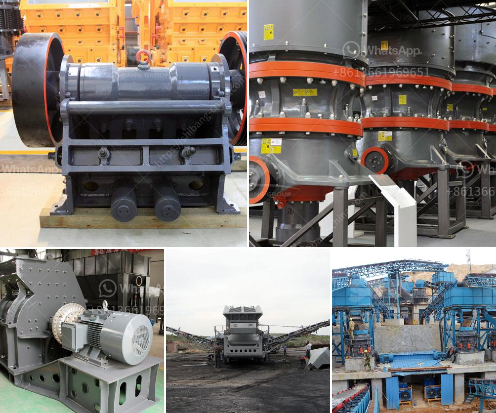

<h3>gypsum grinding machine suppliers</h3>
Gypsum is a mineral that is widely used in construction, agriculture, and other industries. It is a complex rock that consists of calcium sulfate dihydrate, a form of calcium sulfate known as gypsum. It is used as a material for wallboard, plaster, cement, and fertilizer.

To process gypsum, you need a gypsum grinding machine supplier. For the production of gypsum powder, the construction industry requires professional gypsum milling equipment. The gypsum grinding machine suppliers are the leading manufacturers of gypsum grinding machines in China.

With a wide range of equipment for grinding gypsum, they can provide high-quality gypsum grinding machines for sale. The gypsum grinding machines have various types and their functions are different. They mainly include gypsum ball mill, gypsum Raymond mill, gypsum trapezium mill, gypsum ultrafine mill and so on.

Gypsum Ball Mill: It can effectively improve the comprehensive utilization rate of gypsum. The gypsum ball mill grinds the gypsum into powder in a wet or dry state. It is a necessary equipment for the preparation of gypsum raw materials in the construction industry.

Gypsum Raymond Mill: It is mainly used for high-fine powder processing of more than 280 kinds of materials in mining, building materials, chemical industry, and metallurgy. The finished product size can be adjusted within the range of 80-400 mesh. It is an ideal choice for producing fine and ultra-fine gypsum powder.

Gypsum Trapezium Mill: It is a machine that grinds gypsum into powder between two parallel rotating grinding rollers. The grinding roller rotates around the axis and rolls closely on the grinding ring, which greatly improves the grinding efficiency and output of gypsum.

Gypsum Ultrafine Mill: It is a specialized equipment for processing ultrafine powder. It breaks through the limitations of traditional milling equipment, greatly improves the processing efficiency, and produces high-quality gypsum powder.

The gypsum grinding machine suppliers not only provide high-quality gypsum grinding machines but also provide customized services according to customer needs. Their after-sales service is also very thoughtful, providing comprehensive technical support and guidance for gypsum processing.

In addition to gypsum grinding machines, they also provide other gypsum processing equipment, such as gypsum drying equipment, gypsum calcination equipment, gypsum bagging equipment, etc. These equipment can form a complete gypsum processing production line, greatly improving production efficiency and reducing production costs.

In conclusion, the gypsum grinding machine suppliers are reliable and professional manufacturers of gypsum grinding machines. They provide high-quality equipment for grinding gypsum, ensuring the smooth progress of gypsum processing in the construction industry. With their assistance, the construction industry can obtain high-quality gypsum powder for various purposes, promoting the development of the industry.
<h3>Contact us</h3><ul><li><strong>Whatsapp:&nbsp;<a href="https://wa.me/8613661969651">+8613661969651</a></strong></li><li><a href="https://swt.shibang-china.com/?git&amp;zhl&amp;gypsum grinding machine suppliers"><strong>Online Service(chat now)</strong></a></li></ul><h3>Related</h3><ul><li><a href='hammer mill price in nigeria.md'>hammer mill price in nigeria</a></li><li><a href='vibrating screen separator suppliers in philippines.md'>vibrating screen separator suppliers in philippines</a></li><li><a href='used jaw crusher machine for sale nepal.md'>used jaw crusher machine for sale nepal</a></li><li><a href='rock crushers cost tons per hour.md'>rock crushers cost tons per hour</a></li><li><a href='cost of hammer mills for price.md'>cost of hammer mills for price</a></li></ul>