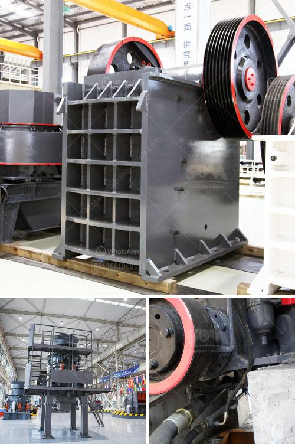

<h3>gypsum manufacturer in ethiopia</h3>
Gypsum is a versatile mineral commonly used in the construction industry due to its strength and durability. It is primarily used for making plaster, drywall, and cement, making it an essential component in the construction sector. In Ethiopia, gypsum production has seen a drastic growth in recent years, thanks to its abundance in the country.

Gypsum manufacturers in Ethiopia are keen to explore the vast untapped potential of the mineral and provide valuable products to the construction industry. The gypsum suppliers in Ethiopia strive to offer high-quality gypsum products to ensure the satisfaction of their customers through various construction projects.

One of the leading gypsum manufacturers in Ethiopia is The Ethiopian Gypsum Industry (TEGI). Established in 2009, TEGI is a joint venture between two prominent Ethiopian companies, East African Mining Corporation (EAMCO) and Ethiopia Gypsum Factory (EGF). TEGI has been instrumental in the production and supply of gypsum for the construction industry in Ethiopia.

The gypsum produced by TEGI is of superior quality, meeting international standards and specifications. The gypsum manufacturer aims to meet the increasing demands of the construction industry while ensuring sustainability and environmental responsibility in their operations. TEGI has taken initiatives to incorporate sustainable practices in their production processes, including resource conservation and waste management.

Apart from TEGI, several other gypsum manufacturers have emerged in Ethiopia, catering to the growing demand for construction materials. These companies play a vital role in Ethiopia's infrastructure development, as gypsum is an essential ingredient in the construction of schools, hospitals, residential buildings, and commercial spaces.

Overall, the presence of gypsum manufacturers in Ethiopia has had a remarkable impact on the construction sector. With their commitment to quality and sustainability, these manufacturers are contributing to the country's economic growth and the development of infrastructure. As the demand for gypsum continues to rise, it is expected that the gypsum industry in Ethiopia will witness further expansion and innovation in the coming years.
<h3>Contact us</h3><ul><li><strong>Whatsapp:&nbsp;<a href="https://wa.me/8613661969651">+8613661969651</a></strong></li><li><a href="https://swt.shibang-china.com/?git&amp;zhl&amp;gypsum manufacturer in ethiopia"><strong>Online Service(chat now)</strong></a></li></ul><h3>Related</h3><ul><li><a href='price for jaw crusher.md'>price for jaw crusher</a></li><li><a href='gold washer machine manufacturer.md'>gold washer machine manufacturer</a></li><li><a href='used stone crushing equipment in assam.md'>used stone crushing equipment in assam</a></li><li><a href='100tpd cement grinding unit cost.md'>100tpd cement grinding unit cost</a></li><li><a href='crusher prices stone crusher primary and secondary.md'>crusher prices stone crusher primary and secondary</a></li></ul>