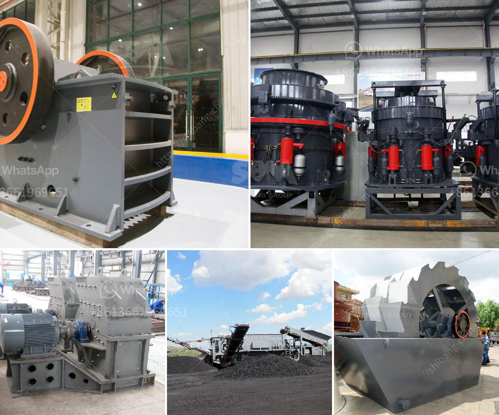

<h3>gypsum mining in garissa</h3>
Gypsum mining in Garissa dates back to the early 1970s. Over the years, this mineral resource has grown in economic importance and is now a significant contributor to the region's economy and livelihoods of the local communities.

Located in the northeastern part of Kenya, Garissa County is known for its arid and semi-arid climate, with limited agricultural opportunities. However, beneath its dry surface lies a valuable mineral deposit of gypsum, the primary raw material used for the production of plaster of Paris, cement, and fertilizer.

Gypsum mining in Garissa has helped stimulate economic development in the region. It has created employment opportunities for the local population, providing income to support their families and improve their living standards. Additionally, the industry has attracted investments and infrastructure development, including road networks, power supply, and amenities that have enhanced the quality of life in the area.

One of the main challenges faced by the gypsum mining sector in Garissa is the sustainability of extraction methods. Due to the arid climate and limited rainfall, the environmental impact of mining activities must be carefully managed to prevent detrimental effects on water sources, vegetation, and wildlife habitat. Companies engaged in gypsum mining have adopted sustainable practices such as reclamation and rehabilitation efforts to restore the land and minimize long-term environmental damage.

Furthermore, the future of gypsum mining in Garissa looks promising as the demand for gypsum-based products is expected to continue growing. The construction industry, both regionally and internationally, relies heavily on gypsum products for its durability, versatility, and fire-resistant properties. The potential for expanded mining operations and increased extraction capacity is immense, contributing to the already notable economic growth of the region.

To ensure the sustainable growth of gypsum mining in Garissa, it is essential for stakeholders, including mining companies, the local government, and communities, to work together in implementing responsible mining practices. This includes strict environmental regulations, monitoring systems, and collaboration in the reclamation of mined-out areas.

Overall, gypsum mining in Garissa has been a game-changer for the region. It has not only provided economic opportunities but also paved the way for infrastructure development and investments. As long as responsible practices and environmental stewardship remain at the core of gypsum extraction, mining in Garissa will continue to make a positive impact on the local economy and contribute to the region's sustainable development.
<h3>Contact us</h3><ul><li><strong>Whatsapp:&nbsp;<a href="https://wa.me/8613661969651">+8613661969651</a></strong></li><li><a href="https://swt.shibang-china.com/?git&amp;zhl&amp;gypsum mining in garissa"><strong>Online Service(chat now)</strong></a></li></ul><h3>Related</h3><ul><li><a href='machines for quarrying of stones.md'>machines for quarrying of stones</a></li><li><a href='sample method statement stone crushing.md'>sample method statement stone crushing</a></li><li><a href='copper ore crushing plant in chile.md'>copper ore crushing plant in chile</a></li><li><a href='rock crusher alibaba.md'>rock crusher alibaba</a></li><li><a href='used stone crusher machines.md'>used stone crusher machines</a></li></ul>