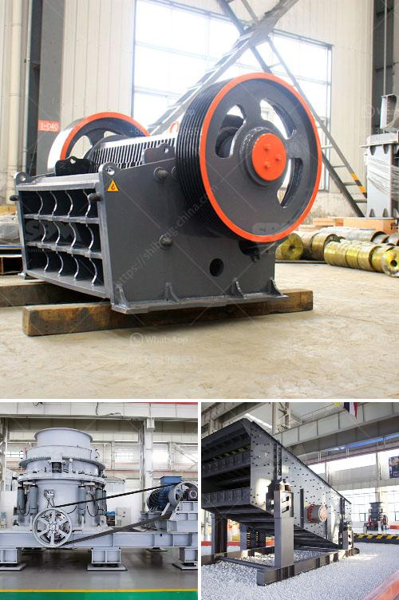

<h3>gypsum plant price</h3>
Gypsum is a widely used material in various industries, especially in construction. It is a naturally occurring mineral that is commonly found in sedimentary rock formations. Gypsum is known for its unique properties, such as its ability to harden when mixed with water, making it an excellent material for creating strong and durable structures.

Gypsum plants are dedicated facilities that process gypsum into various products, including gypsum powder, gypsum boards, and gypsum-based plasters. These plants play a crucial role in meeting the growing demand for gypsum products in the market.

When it comes to determining the price of a gypsum plant, there are several factors to consider. The cost of land acquisition, installation, machinery, and equipment, as well as labor and operational costs, all contribute to the final price of a gypsum plant. Additionally, advancements in technology and automation can also affect the overall cost.

The size and capacity of the plant also play a significant role in determining its price. Larger plants with higher production capacity tend to have higher prices due to the higher costs involved in setting up and running them. However, it is essential to note that larger plants often offer economies of scale, leading to more cost-effective production over time.

Moreover, the geographic location of the plant can influence its price. Different regions have varying costs of land, labor, and resources, leading to variations in plant prices. Additionally, the proximity to raw materials, such as gypsum mines, can also affect the cost of a gypsum plant. Plants located near gypsum mines have the advantage of lower transportation costs, enabling them to offer more competitive prices.

The cost of raw materials, particularly gypsum, can also impact the price of a gypsum plant. Gypsum prices can vary depending on factors such as supply and demand dynamics, production costs, and market conditions. Fluctuations in gypsum prices can directly influence the overall cost of operating a gypsum plant and, consequently, its final price.

Furthermore, technological advancements and innovations in gypsum processing can affect plant prices. Newer and more efficient machinery and equipment can result in higher productivity and reduced operational costs. However, these technological advancements may come at a higher initial cost, thereby impacting the price of a gypsum plant.

In conclusion, the price of a gypsum plant is influenced by various factors such as the cost of land, installation, machinery, labor, and operational expenses. The size and capacity of the plant, as well as its geographic location, also play a role in determining its price. Additionally, fluctuations in gypsum prices and technological advancements can impact a plant's price. It is crucial for investors and industry players to consider these factors when evaluating the cost and feasibility of establishing or acquiring a gypsum plant.
<h3>Contact us</h3><ul><li><strong>Whatsapp:&nbsp;<a href="https://wa.me/8613661969651">+8613661969651</a></strong></li><li><a href="https://swt.shibang-china.com/?git&amp;zhl&amp;gypsum plant price"><strong>Online Service(chat now)</strong></a></li></ul><h3>Related</h3><ul><li><a href='jual crusher batubara di indonesia.md'>jual crusher batubara di indonesia</a></li><li><a href='sell plant crusher of stone.md'>sell plant crusher of stone</a></li><li><a href='company mobile crushers.md'>company mobile crushers</a></li><li><a href='used crusher for sale kenya.md'>used crusher for sale kenya</a></li><li><a href='price of ballast crusher machine in kenya.md'>price of ballast crusher machine in kenya</a></li></ul>