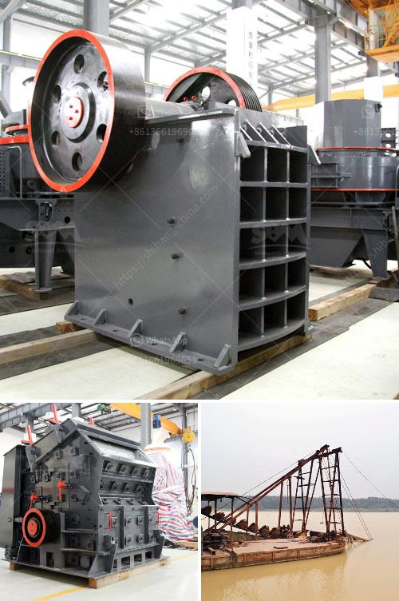

<h3>gypsum powder uses in construction</h3>
Gypsum powder, also known as calcium sulfate dihydrate, is a versatile and widely used building material. It has numerous uses in construction, both in plasterboard and as a binding agent in cement. It is a key ingredient in cement products, which typically comprise 10-15% gypsum powder by mass. Gypsum powder acts as a retarder in cement, slowing down the hydration process and preventing the rapid drying and setting of the mixture. This ultimately improves the workability and setting time of cement, making it easier to pour, level, and finish.

One of the most common uses of gypsum powder in construction is in the creation of drywall or plasterboard. Gypsum powder is mixed with other additives like starch, water, and foaming agents, to form a thick, creamy paste. This paste is then sandwiched between two layers of paper, which gives drywall its strength and insulation properties. Once the paste sets, it hardens and produces a solid, yet relatively lightweight wall material that is easy to work with.

Drywall made from gypsum powder has several advantages over traditional plaster walls. It is quicker to install, requiring less skilled labor and drying time. It also offers improved fire resistance, sound insulation, and moisture resistance, making it ideal for use in kitchens, bathrooms, and other areas prone to moisture or humidity. Gypsum-based plasterboard is also highly recyclable, contributing to sustainability and reducing the environmental impact of construction waste.

Apart from drywall, gypsum powder is also used as a crucial building material in molding and casting processes. It is mixed with water to form a moldable slurry that can be poured into various molds to create decorative or functional architectural elements. Gypsum molding is highly versatile and can be used to create intricate designs such as cornices, ceiling medallions, and ornamental features. It is popular in both residential and commercial construction projects, adding an aesthetic appeal and a touch of elegance to interiors.

Gypsum powder is also utilized as a soil amendment in agriculture and horticulture. It assists in improving soil structure, thereby enhancing water drainage and aeration. Additionally, gypsum helps in the reduction of nutrient runoff and soil erosion, making it particularly useful in arid regions and degraded soils. It also facilitates the uptake of essential nutrients such as calcium and sulfur by plant roots, promoting healthier plant growth and higher crop yields.

In conclusion, gypsum powder has a wide array of uses in the construction industry. From being a key ingredient in cement production to forming the backbone of drywall and serving as a moldable material for decorative elements, gypsum powder plays a crucial role in both structural and aesthetic aspects of construction. Its versatility, ease of use, and environmental benefits make it an attractive choice for builders and architects alike. With ongoing research and innovation, gypsum powder continues to find new applications in the construction sector, contributing to the development of sustainable and efficient building practices.
<h3>Contact us</h3><ul><li><strong>Whatsapp:&nbsp;<a href="https://wa.me/8613661969651">+8613661969651</a></strong></li><li><a href="https://swt.shibang-china.com/?git&amp;zhl&amp;gypsum powder uses in construction"><strong>Online Service(chat now)</strong></a></li></ul><h3>Related</h3><ul><li><a href='malaysia mineral ball mill.md'>malaysia mineral ball mill</a></li><li><a href='jaw crusher supplier in the philippines.md'>jaw crusher supplier in the philippines</a></li><li><a href='gravel jaw crusher.md'>gravel jaw crusher</a></li><li><a href='crusher stone manufacturers.md'>crusher stone manufacturers</a></li><li><a href='calcium carbonate powder making equipment in germany.md'>calcium carbonate powder making equipment in germany</a></li></ul>