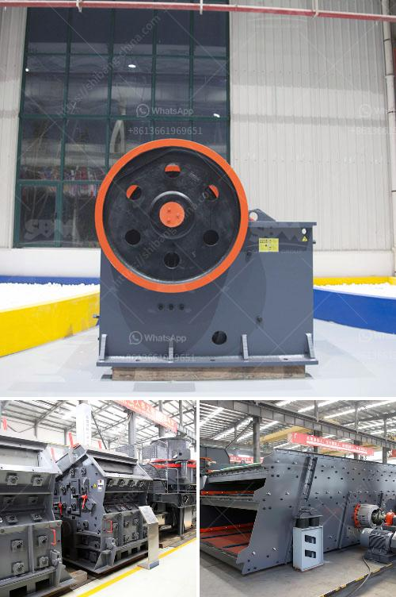

<h3>gypsum router machines in uae</h3>
The use of gypsum in the construction industry has been prevalent for centuries. Its versatility, fire resistance, and ability to add aesthetic appeal to structures have made it a popular choice among architects and builders. However, the traditional methods of cutting and shaping gypsum have often been laborious and time-consuming. This is where gypsum router machines come into the picture, revolutionizing the construction industry in the United Arab Emirates (UAE).

Gypsum router machines, also known as gypsum milling machines or gypsum routers, have become essential tools for modern construction projects in the UAE. These advanced machines utilize cutting-edge technology to precisely cut, shape, and mill gypsum boards, allowing for flawless installations and intricate designs. From creating ornate ceilings and wall panels to designing custom cornices and intricate moldings, gypsum router machines have transformed the possibilities in gypsum utilization.

One of the key advantages of gypsum router machines is their time-saving capabilities. In the past, intricate gypsum designs involved painstaking manual work, which consumed a significant amount of time and effort. With the advent of gypsum routers, what once took days can now be accomplished within hours, resulting in increased productivity and efficiency on construction sites. The automated operation of these machines speeds up the process while maintaining a high level of accuracy and precision.

Another significant benefit of gypsum router machines is their ability to achieve complex designs with ease. These machines employ various cutting techniques, such as routing, drilling, and shaping, to create intricate patterns and textures on gypsum boards. Whether it is replicating traditional architectural elements or crafting modern artistic designs, gypsum routers offer endless possibilities for creativity and customization.

The use of gypsum router machines in the UAE has also contributed to reducing waste in the construction industry. With their precise cutting capabilities, these machines minimize errors and material waste during the gypsum shaping process. The result is cost savings for construction companies and a more sustainable approach to construction.

Furthermore, gypsum router machines enhance the overall quality and durability of gypsum installations. The precise cuts and edges achieved by these machines ensure perfect fitting, eliminating gaps and imperfections. This contributes to the longevity and stability of gypsum structures, increasing their resistance to wear and tear while maintaining their aesthetic appeal.

Despite their numerous benefits, gypsum router machines have been relatively underutilized in the region until recently. However, as the construction industry in the UAE continues to evolve, builders and contractors are recognizing the value of these advanced tools. The demand for gypsum router machines is steadily growing, and manufacturers and suppliers are responding by introducing a wider range of models, ensuring accessibility and affordability for all construction stakeholders.

In conclusion, gypsum router machines are revolutionizing the construction industry in the UAE. Their time-saving capabilities, ability to achieve intricate designs, reduction of waste, and enhancement of quality make them indispensable tools for gypsum-related projects. As the construction sector in the UAE continues to evolve, the adoption of gypsum routers will undoubtedly increase, resulting in a more efficient, sustainable, and visually stunning built environment.
<h3>Contact us</h3><ul><li><strong>Whatsapp:&nbsp;<a href="https://wa.me/8613661969651">+8613661969651</a></strong></li><li><a href="https://swt.shibang-china.com/?git&amp;zhl&amp;gypsum router machines in uae"><strong>Online Service(chat now)</strong></a></li></ul><h3>Related</h3><ul><li><a href='quarry ccrusher equipment price.md'>quarry ccrusher equipment price</a></li><li><a href='stone crusher plant pakistan feasibility report.md'>stone crusher plant pakistan feasibility report</a></li><li><a href='nigeria stone crusher to buy.md'>nigeria stone crusher to buy</a></li><li><a href='kaolin processing unit.md'>kaolin processing unit</a></li><li><a href='manufactures mineral crusher oruro bolivia.md'>manufactures mineral crusher oruro bolivia</a></li></ul>