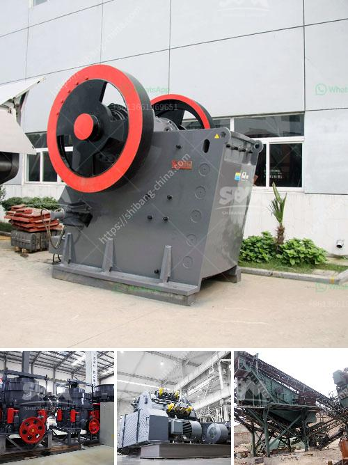

<h3>hammer crusher german made</h3>
Hammer Crusher German Made: The hammer crusher is a crushing machine that uses impact energy to crush materials. It is widely used in metal and non-metallic ore, cement, construction, sand, metallurgy and other industries. Hammer crusher has the characteristics of simple structure, large crushing ratio, high production efficiency, etc.

In recent years, with the rapid development of China's economy and the continuous improvement of people's quality of life, the demand for sand and gravel aggregates has been increasing, and the market for hammer crushers has also been expanding. Among them, German-made hammer crushers have become the first choice for many users due to their high quality, stable performance and long service life.

The German-made hammer crusher is made of a high-quality alloy steel hammerhead and a high-strength wear-resistant material. It is not only durable, but also has a very good crushing effect. The hammer crusher is suitable for crushing medium-hard materials such as limestone, slag, coke, coal and other materials in cement, chemical, electric power, metallurgy and other industrial sectors.

1. Excellent performance: The hammer crusher has a large crushing ratio and high production efficiency. The output size can be adjusted according to the user's requirements, and the particle size of the finished product is uniform and fine.

2. Simple structure and easy maintenance: The German-made hammer crusher has a simple structure, easy operation and maintenance, and low maintenance costs. The high-quality steel hammerhead is easy to disassemble and replace, which greatly reduces the downtime for maintenance.

3. Energy saving and environmental protection: The German-made hammer crusher has a low energy consumption design, which can save a lot of energy during production. At the same time, it has a good dustproof effect, which can effectively reduce the dust pollution during the crushing process, and is in line with current environmental protection standards.

4. Wide application range: The German-made hammer crusher can not only crush materials with large hardness, but also crush materials with high humidity. It is suitable for crushing various materials such as limestone, coal, salt, gypsum, brick, tile, etc.

In summary, the German-made hammer crusher has excellent performance, simple structure, easy maintenance, energy saving, environmental protection, and wide application range. It is an ideal choice for crushing medium-hard materials in various industries. With the continuous improvement of technology, the German-made hammer crusher will have more advanced features and a broader market prospect.
<h3>Contact us</h3><ul><li><strong>Whatsapp:&nbsp;<a href="https://wa.me/8613661969651">+8613661969651</a></strong></li><li><a href="https://swt.shibang-china.com/?git&amp;zhl&amp;hammer crusher german made"><strong>Online Service(chat now)</strong></a></li></ul><h3>Related</h3><ul><li><a href='malaysia sand washer supplier.md'>malaysia sand washer supplier</a></li><li><a href='grinding tunbe mill and ball mill.md'>grinding tunbe mill and ball mill</a></li><li><a href='gold recovery process flow diagram pdf.md'>gold recovery process flow diagram pdf</a></li><li><a href='how much is a crusher.md'>how much is a crusher</a></li><li><a href='conical ball mill for sale.md'>conical ball mill for sale</a></li></ul>