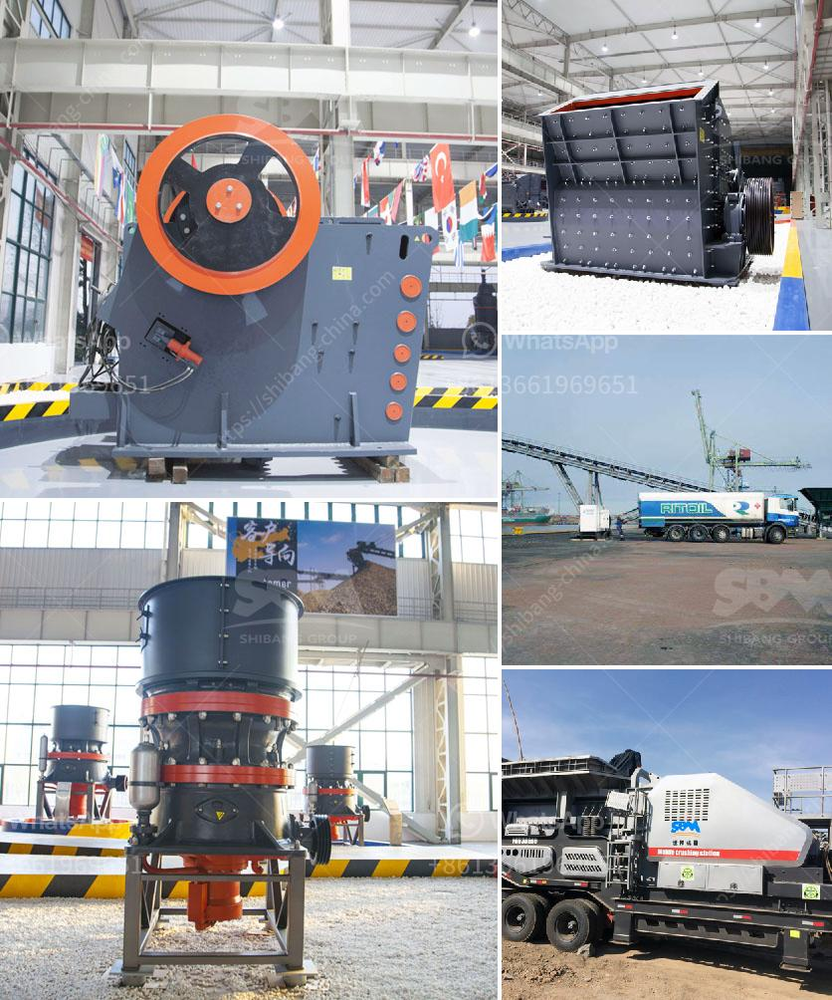

<h3>hammer crusher parameters introduced in detail</h3>
Hammer crusher belongs to a more advanced crushing equipment. It uses impact energy to crush materials. This is a characteristic that distinguishes it from other crushers and is a good way to process bulk materials such as limestone, feldspar, calcite, granite, talc, barite, fluorite, rare earth, coke, coal gangue, gypsum and so on.

The hammer crusher is composed of a hammer crusher housing, a rotor, a hammer head, a counter lining plate, a sieve plate, and the like. The crusher has four main parts: the crushing chamber, the rotor assembly, the hammerhead, and the motor.

The crushing chamber is the main working component of the crusher, which is composed of a rotor disc and a hammer head. The materials entered from the top of the crusher, fell into the crushing chamber, and were crushed by the high-speed rotating hammer heads. The crushed materials were discharged through the sieve plate, and the size of the discharged material can be adjusted by the setting of the sieve plate gap.

The rotor assembly is the core part of the hammer crusher. It is composed of the rotor disc, the hammer heads, and the shaft pin. When the motor drives the rotor to rotate at a high speed, the hammer heads on the rotor disc crush the materials in the crushing chamber with a high impact force.

The hammerhead is the working part of the hammer crusher. It is directly driven by the motor. The rotor disc will be brought to a high-speed rotation under the drive of the motor, and the impact force will be generated by the high-speed rotation, thereby crushing the materials.

The parameters of the hammer crusher mainly include the diameter of the rotor, the length of the axis, the length of the hammerhead, the size of the sieve plate, the speed of the rotor, the weighing device, the speed of the motor and the power of the motor. These parameters determine the productivity of the hammer crusher.

Generally, the higher the rotor speed, the higher the speed of material processing in the crushing chamber. Therefore, the speed of the rotor should be selected according to the specific operation requirements. However, the speed of the rotor should not exceed the working speed range specified by the manufacturer.

The length of the hammerhead directly affects the crushing efficiency and production capacity of the hammer crusher. The longer the hammerhead, the greater the striking force it possesses, and the higher the crushing efficiency is. However, if the hammerhead is too long, it will increase the weight and wear of the rotor, resulting in increased power consumption.

The size of the sieve plate directly affects the particle size of the discharged material. Different sieve plates can be selected according to the specific requirements of particle size. The sieve plate should be selected according to the size of the material to prevent the sieve plate from being blocked and affecting production efficiency.

In summary, the parameters of the hammer crusher mainly include the diameter of the rotor, the length of the axis, the length of the hammerhead, the size of the sieve plate, the speed of the rotor, the weighing device, the speed of the motor and the power of the motor. These parameters determine the productivity and particle size of the hammer crusher. Therefore, when selecting and adjusting the parameters, it is necessary to comprehensively consider the specific requirements of the material and the production capacity to achieve the best crushing effect.
<h3>Contact us</h3><ul><li><strong>Whatsapp:&nbsp;<a href="https://wa.me/8613661969651">+8613661969651</a></strong></li><li><a href="https://swt.shibang-china.com/?git&amp;zhl&amp;hammer crusher parameters introduced in detail"><strong>Online Service(chat now)</strong></a></li></ul><h3>Related</h3><ul><li><a href='iron ore cruseher plant.md'>iron ore cruseher plant</a></li><li><a href='hammer mill mining south africa.md'>hammer mill mining south africa</a></li><li><a href='hammer mill supplers in bulawayo.md'>hammer mill supplers in bulawayo</a></li><li><a href='jaw crushers for sale in zimbabwe.md'>jaw crushers for sale in zimbabwe</a></li><li><a href='jaw crusher for sale in auction.md'>jaw crusher for sale in auction</a></li></ul>