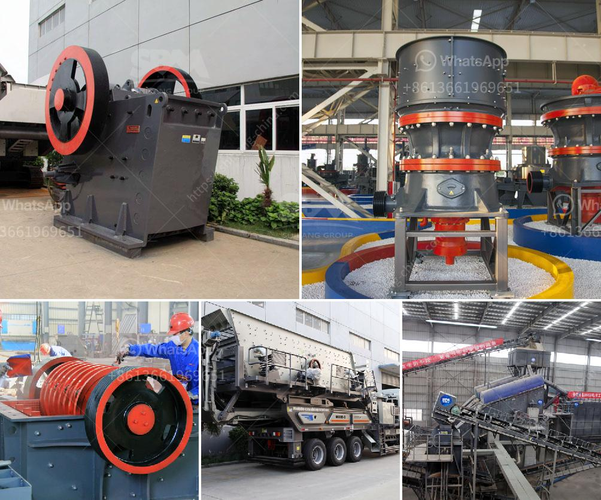

<h3>hammer crusher taiwan</h3>
When it comes to crushing large rocks or ores, there are few options available for homeowners or entrepreneurs. However, one particular device has gained immense popularity due to its reliability, versatility, and efficiency – the hammer crusher from Taiwan. Designed to break down even the toughest materials, the hammer crusher is a dependable choice for various crushing applications.

The hammer crusher, also known as the hammer mill, is a powerful machine used to reduce the size of large rocks, gravel, or rock dust. It is commonly used in mines, construction projects, and building material recycling applications. Due to its ability to crush tough and abrasive materials, such as limestone, coal, or metal ores, the hammer crusher is widely used in industries like mining, cement, coal, metallurgy, construction, and road construction.

One of the key advantages of the hammer crusher is its versatility. With its adjustable clearance between the impact plate and the hammer, it can cater to different output sizes. This versatility allows the hammer crusher to meet the requirements of various crushing tasks. Whether you need to produce fine sand, coarse aggregates, or-sized materials, the hammer crusher can handle it all.

Aside from its versatility, the hammer crusher is also known for its high efficiency. The hammer’s rotational speed and the geometry of the hammerhead play a crucial role in crushing materials efficiently. The hammer crusher’s design ensures that the particles are properly crushed and discharged through the grate openings, preventing any kind of blockages. This enables smooth and continuous operation, resulting in higher productivity and lower maintenance costs.

Furthermore, the hammer crusher from Taiwan is built to last. Its robust construction and high-quality materials make it a durable choice for demanding applications. The steel frame and cast iron housing provide excellent strength and stability, ensuring reliable performance even under heavy-duty conditions. Additionally, the hammer crusher is equipped with interchangeable wear parts, such as the rotor, hammerheads, and grates, making maintenance and replacements convenient and cost-effective.

Safety is also a top priority with the hammer crusher. The machine is designed with safety features that prevent accidental injuries or damage. For instance, the emergency stop button allows operators to quickly halt the machine in case of hazards or emergencies. The housing and protective covers also protect operators from flying debris or dust generated during the crushing process.

In conclusion, the hammer crusher from Taiwan offers a reliable and versatile solution for crushing various materials. With its adjustable clearance, high efficiency, and durable construction, it is suitable for diverse crushing applications, including mining, cement, and construction. Furthermore, its safety features provide peace of mind for operators. Whether you need to crush large rocks, ores, or other tough materials, the hammer crusher is an excellent choice. So, if you are in search of an efficient and reliable crushing solution, consider the hammer crusher from Taiwan.
<h3>Contact us</h3><ul><li><strong>Whatsapp:&nbsp;<a href="https://wa.me/8613661969651">+8613661969651</a></strong></li><li><a href="https://swt.shibang-china.com/?git&amp;zhl&amp;hammer crusher taiwan"><strong>Online Service(chat now)</strong></a></li></ul><h3>Related</h3><ul><li><a href='small gold ore crusher grinder.md'>small gold ore crusher grinder</a></li><li><a href='river sand washing machine.md'>river sand washing machine</a></li><li><a href='stone crusher plant operator job.md'>stone crusher plant operator job</a></li><li><a href='industrial mill and prices.md'>industrial mill and prices</a></li><li><a href='granite processing plant prices.md'>granite processing plant prices</a></li></ul>