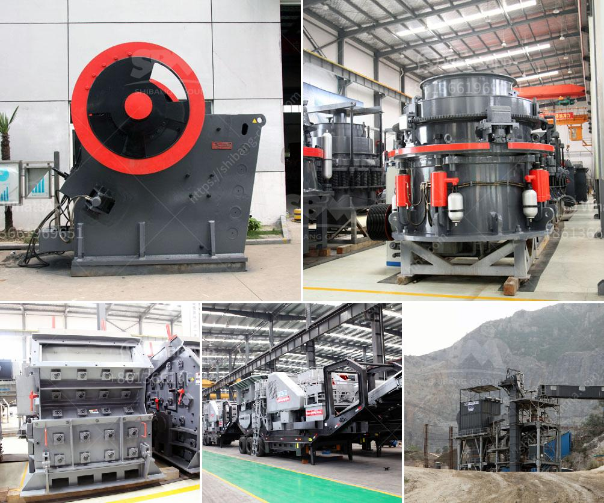

<h3>hammer mill crusher</h3>
A hammer mill crusher is a machine that utilizes steel hammers to pulverize materials, such as grain and wood residue, into smaller pieces. The machine is commonly used in applications where the materials need to be reduced in size or crushed for further processing.

The hammer mill crusher operates on a high-speed rotor that rotates at around 3,600 rpm. As the material enters the crusher, it is impacted by the hammers against the inner surface of the rotor. This initial impact breaks the material down into smaller particles, and it continues to be pulverized as it is repeatedly struck by the rotating hammers.

The size of the final product depends on the size of the screen openings on the machine. By adjusting these openings, operators can control the final size of the crushed material. This makes the hammer mill crusher suitable for a wide range of applications, including feed processing, wood processing, and biomass fuel production.

One of the key advantages of a hammer mill crusher is its versatility. Since different materials will have different properties, the machine can be easily adjusted to accommodate various materials and achieve optimal crushing results. Additionally, the machine can handle both dry and wet materials, which further expands its application range.

Another advantage of using a hammer mill crusher is its efficiency. The high speed and impact force of the rotating hammers ensure efficient and rapid crushing of the materials. This allows for higher production efficiency and reduced energy consumption compared to other crushing machines.

In conclusion, a hammer mill crusher is a versatile and efficient machine that is capable of pulverizing a wide range of materials. Its ability to crush, grind, or pulverize materials into smaller pieces makes it an essential tool in many industries. Whether it is used in feed processing, wood processing, or biomass fuel production, the hammer mill crusher offers reliable performance and excellent crushing results.
<h3>Contact us</h3><ul><li><strong>Whatsapp:&nbsp;<a href="https://wa.me/8613661969651">+8613661969651</a></strong></li><li><a href="https://swt.shibang-china.com/?git&amp;zhl&amp;hammer mill crusher"><strong>Online Service(chat now)</strong></a></li></ul><h3>Related</h3><ul><li><a href='small scale mining equipment south africa price.md'>small scale mining equipment south africa price</a></li><li><a href='cement clinker grinding mill.md'>cement clinker grinding mill</a></li><li><a href='crusher manufacturer in.md'>crusher manufacturer in</a></li><li><a href='cone crushers washing system.md'>cone crushers washing system</a></li><li><a href='stone crushing equipment available.md'>stone crushing equipment available</a></li></ul>