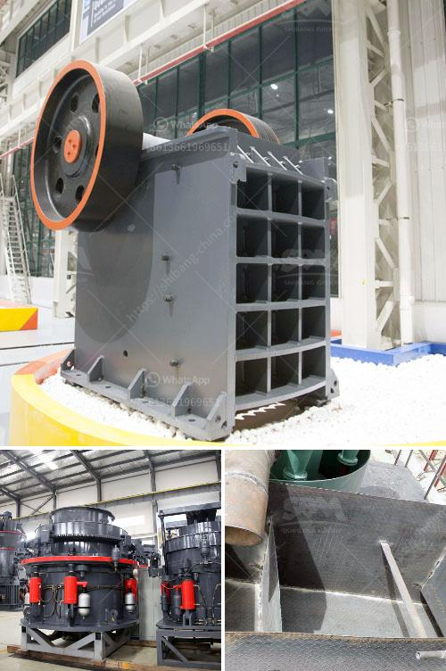

<h3>hammer mill design drawing pdf</h3>
The hammer mill design drawing pdf is extremely popular today, especially in the manufacturing industry. It is not only used in grinding grains, but is also widely utilized in shredding paper, wood, and even plastic materials. With a design that utilizes hammers and screens, it is capable of reducing particle size with ease.

One of the key features of the hammer mill design drawing pdf is its simplicity. It is relatively easy to understand and operate, making it an ideal choice for manufacturers of all sizes. The basic design consists of a rotor with hammers attached, which spins at high speeds inside a chamber. The material fed into the chamber is hammered by the rotating hammers, ultimately reducing the particle size.

Another important aspect of the hammer mill design drawing pdf is its versatility. It can accommodate a variety of materials, allowing manufacturers to grind or shred different types of products. The size and shape of the screen can also be adjusted to achieve the desired particle size. This flexibility makes the hammer mill a versatile tool that can be used for various applications.

Furthermore, the hammer mill design drawing pdf is highly efficient when it comes to energy consumption. It requires less power to operate compared to other grinding or shredding machines, making it a cost-effective option for manufacturers. Additionally, the design of the hammers and screens ensures a consistent particle size, resulting in a more uniform product.

In conclusion, the hammer mill design drawing pdf is a powerful and versatile tool in the manufacturing industry. Its simplicity, versatility, and energy efficiency make it an ideal choice for manufacturers seeking to reduce particle size or shred materials. With its ability to handle different types of materials and achieve consistent results, the hammer mill is a valuable asset for any manufacturing operation.
<h3>Contact us</h3><ul><li><strong>Whatsapp:&nbsp;<a href="https://wa.me/8613661969651">+8613661969651</a></strong></li><li><a href="https://swt.shibang-china.com/?git&amp;zhl&amp;hammer mill design drawing pdf"><strong>Online Service(chat now)</strong></a></li></ul><h3>Related</h3><ul><li><a href='grinder machine for fine powder.md'>grinder machine for fine powder</a></li><li><a href='jual stone crusher plant kredit.md'>jual stone crusher plant kredit</a></li><li><a href='limestone coal grinding machinery manufacture in india.md'>limestone coal grinding machinery manufacture in india</a></li><li><a href='how to make a stone breaker.md'>how to make a stone breaker</a></li><li><a href='used crusher for sale sell buy.md'>used crusher for sale sell buy</a></li></ul>