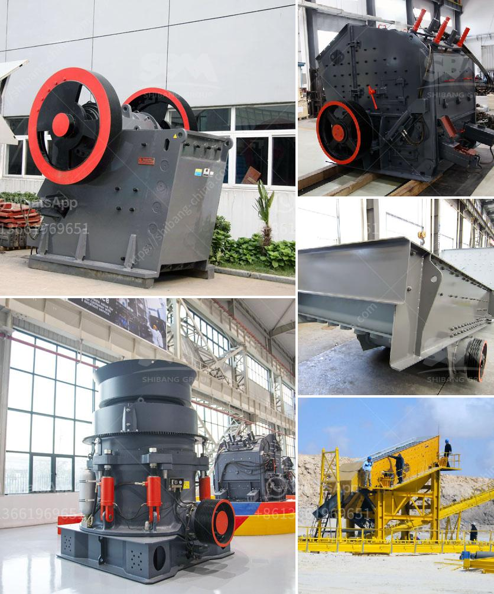

<h3>hammer mill for concentrate price</h3>
A hammer mill for concentrate is a machine that grinds and crushes materials, typically in powder form, into a fine and consistent particle size. These mills are commonly used in the chemical, pharmaceutical, mining, and agriculture industries to reduce the size of raw materials before further processing. The concentrate price is an important factor to consider when investing in a hammer mill.

Hammer mills are designed to be durable and efficient, with a high-speed rotating shaft fitted with hammers or blades that strike and break down the material. The size of the end product can be controlled by adjusting the gap between the hammer and the screen that covers the grinding chamber. This versatility allows for various products, including concentrates, to be effectively processed.

One of the main advantages of using a hammer mill for concentrate processing is its ability to produce a consistent and uniform particle size. This is critical for many industries that require material to be of a specific size for further processing, such as in the manufacturing of medicines or animal feed. The consistent particle size ensures that the final product will have the desired properties and performance.

Another advantage of using a hammer mill is its flexibility in processing different types of materials. Whether it's minerals, chemicals, or agricultural products, a hammer mill can handle a wide range of materials. This versatility makes it an attractive choice for many industries looking to process various materials into concentrates.

The price of a hammer mill for concentrate is determined by several factors. The size and capacity of the machine, as well as the horsepower of the motor, all contribute to the overall cost. Additionally, the quality and durability of the materials used in the construction of the mill, such as the hammers and screens, can influence the price. Higher quality components may come at a higher cost but can also result in a longer lifespan and more efficient performance.

It is important to consider the long-term benefits when evaluating the price of a hammer mill for concentrate. A higher initial investment may be justified by increased productivity and reduced maintenance costs over time. Additionally, selecting a reputable manufacturer with a track record of producing reliable and high-quality equipment can help ensure a long-lasting and reliable hammer mill.

In conclusion, a hammer mill for concentrate processing offers many advantages, including its ability to produce a consistent particle size and flexibility in processing various materials. The price of a hammer mill is influenced by factors such as its size, capacity, motor horsepower, and the quality of its components. Investing in a hammer mill with a higher upfront cost may result in long-term benefits, including increased productivity and reduced maintenance costs. Choosing a reputable manufacturer is essential to ensure a reliable and efficient machine.
<h3>Contact us</h3><ul><li><strong>Whatsapp:&nbsp;<a href="https://wa.me/8613661969651">+8613661969651</a></strong></li><li><a href="https://swt.shibang-china.com/?git&amp;zhl&amp;hammer mill for concentrate price"><strong>Online Service(chat now)</strong></a></li></ul><h3>Related</h3><ul><li><a href='portable cone crusher specification.md'>portable cone crusher specification</a></li><li><a href='indonesia vertical grinding machine.md'>indonesia vertical grinding machine</a></li><li><a href='hammer mill in bogota.md'>hammer mill in bogota</a></li><li><a href='stone crusher plant ton jam.md'>stone crusher plant ton jam</a></li><li><a href='gold mining equipment stores in tanzania.md'>gold mining equipment stores in tanzania</a></li></ul>