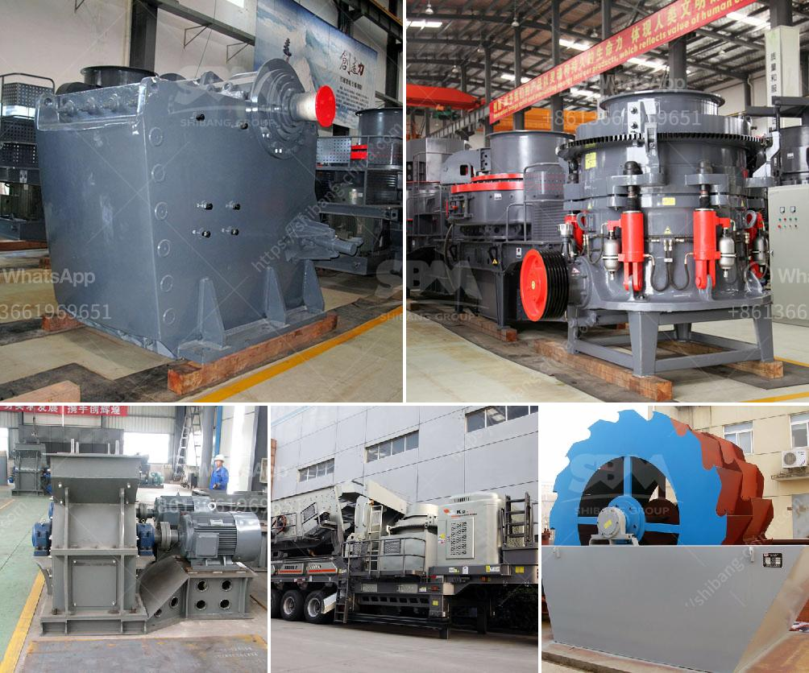

<h3>hammer mill for silica stone</h3>
Silica is abundantly found in nature and is a vital raw material for various industries, particularly in the production of glass. When crushed, silica stone becomes silica sand, a key component for the manufacturing of concrete and other construction materials. Silica has a high melting point, making it useful in the creation of alloys and ceramics. To obtain silica sand, a crucial step involves reducing the size of silica stone through a hammer mill.

A hammer mill is a machine that uses rotating blades and hammers to crush materials, typically into fine powders. Hammer mills are utilized in a wide range of applications within various industries, including mining, industrial manufacturing, construction, and even food processing. In the case of silica stone, a hammer mill breaks down the stone into smaller grains or powders suitable for various industrial uses.

One of the primary advantages of a hammer mill is its versatility. Hammer mills can handle a wide variety of materials, including soft and hard rocks, fibrous materials, and abrasive substances like silica stone. This adaptability makes hammer mills an excellent choice for silica stone processing.

In the processing of silica stone, a hammer mill can generally process materials with a diameter ranging from 0-200mm, typical fineness for silica sand is 90-100 microns. Hammer mills are excellent at generating uniform particle sizes, thereby optimizing the efficiency of downstream processes such as drying, mixing, and bagging.

Moreover, hammer mills offer other significant advantages such as the ability to control the size of the particles produced. By adjusting the speed and clearance between the blades and housing, operators can tailor the final output to meet their specific requirements. This level of control ensures consistency and quality in the resulting silica sand.

Additionally, hammer mills are known for their low energy consumption compared to other size reduction machines. This energy efficiency is especially beneficial for large-scale industrial operations, reducing production costs and lowering the overall carbon footprint.

Silica stone is typically hard and brittle, requiring a robust machine to crush it effectively. Hammer mills are purpose-built to handle such abrasive materials, featuring heavy-duty construction. The high-speed rotating blades and hammers not only break down the stone but also pulverize it, reducing it to a fine powder that can be used for various applications.

The versatility and efficiency of hammer mills make them suitable for a wide range of industries. Silica stone, in particular, benefits greatly from the use of a hammer mill due to its excellent particle size control and uniformity. With the ability to optimize the output and reduce energy consumption, a hammer mill provides a valuable solution for processing silica stone efficiently and cost-effectively.

In conclusion, a hammer mill plays a crucial role in crushing silica stone into the desired particle size for various industrial applications. With its versatility, efficiency, and ability to control the particle size, a hammer mill is an ideal choice for efficient silica stone processing.
<h3>Contact us</h3><ul><li><strong>Whatsapp:&nbsp;<a href="https://wa.me/8613661969651">+8613661969651</a></strong></li><li><a href="https://swt.shibang-china.com/?git&amp;zhl&amp;hammer mill for silica stone"><strong>Online Service(chat now)</strong></a></li></ul><h3>Related</h3><ul><li><a href='silicon ore processing equipment.md'>silicon ore processing equipment</a></li><li><a href='cement plants in west bengal list.md'>cement plants in west bengal list</a></li><li><a href='jaw crusher private sale south africa.md'>jaw crusher private sale south africa</a></li><li><a href='all model vsi crusher.md'>all model vsi crusher</a></li><li><a href='making gypsum powder mill.md'>making gypsum powder mill</a></li></ul>