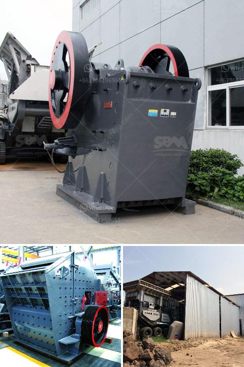

<h3>hammer mill in bogota</h3>
The use of hammer mills in Bogota has become increasingly popular in recent years due to their efficiency and versatility. A hammer mill is a machine that is used to shred or crush materials into smaller pieces. It consists of a large rotating hammer, which is driven by a motor, and a mesh screen that allows the desired size of the shredded or crushed material to pass through.

One of the key benefits of using a hammer mill in Bogota is its ability to reduce the size of various materials such as agricultural waste, wood chips, paper, metals, and plastics. This makes it a valuable tool for recycling and waste management. By reducing the size of these materials, they can be easily transported and processed for further use.

Another advantage of using a hammer mill is its cost effectiveness. Compared to other size reduction equipment, hammer mills are relatively inexpensive and require less maintenance. This makes them a viable option for small businesses or individuals who need to process materials on a limited budget.

In addition, hammer mills are known for their high efficiency in grinding and crushing. The rotating hammers generate a strong impact, which allows them to break down materials quickly and effectively. This results in a finer particle size and a more uniform end product.

The versatility of hammer mills in Bogota is another reason for their growing popularity. They can be used in various industries, including agriculture, food processing, and pharmaceuticals. Whether it's grinding corn for animal feed, processing spices for the food industry, or pulverizing pharmaceutical ingredients, a hammer mill can handle a wide range of materials and applications.

In conclusion, hammer mills have become an essential tool for many businesses in Bogota. Their ability to shred, crush, and process various materials efficiently and cost-effectively has made them a popular choice. With the growing focus on recycling and waste management, hammer mills are set to play a vital role in Bogota's sustainable development efforts.
<h3>Contact us</h3><ul><li><strong>Whatsapp:&nbsp;<a href="https://wa.me/8613661969651">+8613661969651</a></strong></li><li><a href="https://swt.shibang-china.com/?git&amp;zhl&amp;hammer mill in bogota"><strong>Online Service(chat now)</strong></a></li></ul><h3>Related</h3><ul><li><a href='how much is scm series ultrafine mill machine in usa.md'>how much is scm series ultrafine mill machine in usa</a></li><li><a href='stone quarrying process.md'>stone quarrying process</a></li><li><a href='gold corporation ball mill.md'>gold corporation ball mill</a></li><li><a href='limestone treatment plant.md'>limestone treatment plant</a></li><li><a href='iron ore beneficiation proposal.md'>iron ore beneficiation proposal</a></li></ul>