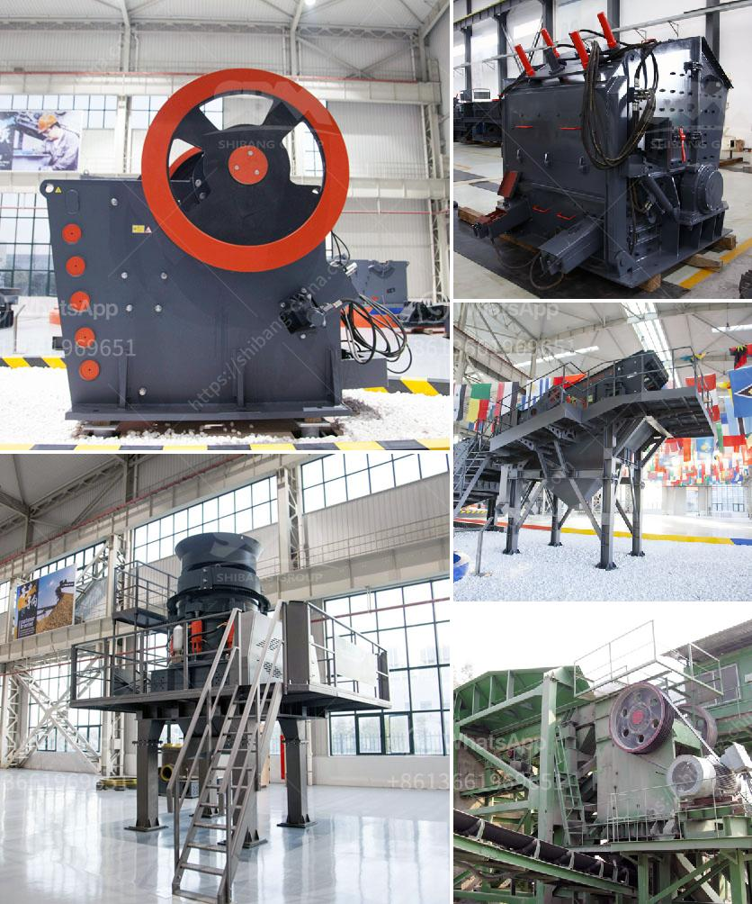

<h3>hammer mill manufacturer in tamilnadu</h3>
The hammer mill manufacturer in Tamil Nadu, also known as the HMS manufacturer, is an industry-leading manufacturer of hammer mills. In this article, we will discuss the various features of the hammer mill, the manufacturing process, and its applications.

A hammer mill is a machine that is designed to shred or crush different materials into smaller pieces. It consists of a series of hammers, mounted on a rotating shaft within a cylindrical casing. The materials to be processed are fed into the inlet hopper of the machine and are impacted by the hammers as they rotate at high speed. The force of the impact breaks the materials into smaller pieces, which can then pass through a series of screens to separate the desired particle size.

In Tamil Nadu, there are several manufacturers of hammer mills catering to various industries such as agriculture, pharmaceuticals, food processing, and mining. These manufacturers utilize advanced technology and high-quality materials to produce efficient and durable machines.

The manufacturing process of the hammer mill involves several steps, starting from the selection of raw materials. The manufacturers source high-grade steel and other necessary components to ensure the robustness and longevity of the machine. They also employ skilled technicians who possess expertise in the fabrication and assembly of the hammer mill.

Once the components are ready, they are assembled and tested rigorously to ensure that the machine meets the required performance standards. The manufacturers also conduct trial runs to identify any potential issues and make necessary adjustments before the final dispatch of the hammer mill.

The hammer mill manufactured in Tamil Nadu has numerous applications in various industries. In agriculture, it is used to grind grains, corn, and biomass materials for animal feed or to produce biofuel. In the food processing industry, it is utilized to mill spices, herbs, and other ingredients into powders or pastes. It is also commonly used in the pharmaceutical industry to pulverize medications and chemicals.

The hammer mill offers several advantages over traditional milling machines. It is highly efficient and can process large quantities of materials in a short time. The adjustable screens allow for precise control over the particle size, enabling manufacturers to obtain the desired consistency. Additionally, the machine is easy to operate, requires minimal maintenance, and is built to withstand heavy-duty usage.

When choosing a hammer mill manufacturer in Tamil Nadu, it is crucial to consider factors such as the reputation of the manufacturer, after-sales service, and warranty options. The manufacturer should have a track record of delivering high-quality products and reliable customer support.

In conclusion, the hammer mill manufacturer in Tamil Nadu plays a crucial role in providing efficient and reliable milling machines to various industries. Their expertise in manufacturing and advanced technology ensures that the hammer mills meet the required performance standards. The diverse applications and numerous advantages of the hammer mill make it a valuable asset for industries in Tamil Nadu and beyond.
<h3>Contact us</h3><ul><li><strong>Whatsapp:&nbsp;<a href="https://wa.me/8613661969651">+8613661969651</a></strong></li><li><a href="https://swt.shibang-china.com/?git&amp;zhl&amp;hammer mill manufacturer in tamilnadu"><strong>Online Service(chat now)</strong></a></li></ul><h3>Related</h3><ul><li><a href='jaw crushers from saudi.md'>jaw crushers from saudi</a></li><li><a href='logo of stone crusher.md'>logo of stone crusher</a></li><li><a href='how to make fly ash.md'>how to make fly ash</a></li><li><a href='top mining equipment supplier in south africa.md'>top mining equipment supplier in south africa</a></li><li><a href='japan mobile stone crusher machine.md'>japan mobile stone crusher machine</a></li></ul>