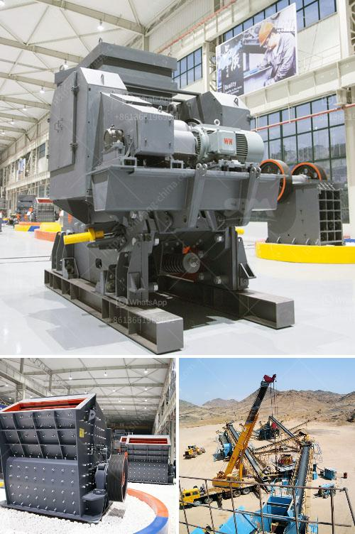

<h3>hammer mill mining south africa</h3>
Hammer mill mining is undoubtedly a very important aspect of mining in South Africa. Hammer mill mining plays a crucial role in the South African mining industry, as it is used to crush and grind various materials for further processing. This process is vital in extracting the valuable minerals and ores that are present in the earth's crust.

A hammer mill is a type of crusher that can be used for grinding, crushing, and pulverizing materials. It consists of a rotating drum with hammers that crush the materials against a metal screen. The hammers are free to swing on the ends of the cross, or fixed to the central rotor. This makes the hammer mill extremely versatile and suitable for a wide range of applications in mining operations.

South Africa has a rich mining history and the industry has been a key driver of the country's economic growth. Over the years, hammer mills have been specifically developed for the needs of the South African mining industry. This has led to the design and production of various models capable of handling different tonnages and fineness of materials.

Hammer mills can be used in a variety of industries, including mining, construction, and waste management. The versatility of the hammer mill makes it an ideal piece of equipment for the mining industry. With its ability to crush materials of varying hardness, it can be used for crushing anything from rocks, to coal, to glass and even agricultural products.

In conclusion, hammer mill mining is an essential process in South Africa's mining industry. This versatile piece of equipment is proven to be an effective and efficient tool for crushing and grinding materials. It has contributed immensely to the growth and development of the mining industry, making it a crucial process for extracting valuable minerals and ores.
<h3>Contact us</h3><ul><li><strong>Whatsapp:&nbsp;<a href="https://wa.me/8613661969651">+8613661969651</a></strong></li><li><a href="https://swt.shibang-china.com/?git&amp;zhl&amp;hammer mill mining south africa"><strong>Online Service(chat now)</strong></a></li></ul><h3>Related</h3><ul><li><a href='crusher for sale in kerala.md'>crusher for sale in kerala</a></li><li><a href='used jaw crushers with price in pakistan.md'>used jaw crushers with price in pakistan</a></li><li><a href='process of making quartz marble crusher.md'>process of making quartz marble crusher</a></li><li><a href='gypsum beneficiation process.md'>gypsum beneficiation process</a></li><li><a href='crushing hpc cone crusher.md'>crushing hpc cone crusher</a></li></ul>