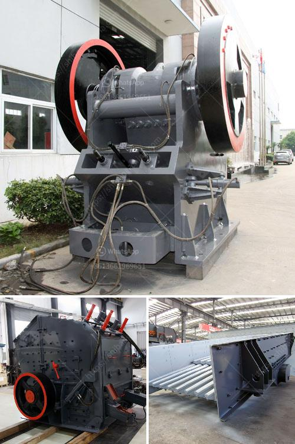

<h3>hammer mill price in nigeria</h3>
Hammer mill is a machine used to shred or crush materials into smaller pieces. In Nigeria, hammer mill is widely used in the mining, cement, metallurgy, building materials, road construction, and many other industries. With the wide application of hammer mill in these industries, the market demand for hammer mill is constantly increasing.

According to statistics, in 2018, Nigeria imported hammer mill worth over 15 million US dollars, mainly from China. The total value of imports exceeded 8,000 units. The number of hammer mills sold has more than doubled since 2005, surpassing both Nigeria's imports and exports, and is hoped to continue to grow in the coming years.

Hammer mill is a machine that grinds, crushes, and pulverizes materials into various sizes. It is used to produce the following materials:

1. Groundnut husks: Groundnut husks are by-products of groundnut oil production. They can be used as biomass fuel for heating or animal feed.

2. Maize: Nigeria is the largest producer of maize in Africa and here, hammer mill helps to process the raw maize into usable form for making various food products.

3. Cassava: Cassava is a major staple food in Nigeria. Hammer mill helps crush, grind or pulverize cassava for other purposes such as production of ethanol or starch.

4. Limestone: The main component of cement is limestone. A hammer mill helps pulverize this abundant mineral resource into smaller pieces, making it easy to process.

5. Animal feed: Animal feeds are made from a variety of ingredients such as cereals, grains, oilseed meals, and by-products from the food processing industry. Hammer mill helps in reducing the particle size of these ingredients for easy processing.

The price of a hammer mill varies depending on the size and capacity. The capacity ranges from 500 kg/hr to 100 tons/hr. Although the price range for a lower-capacity hammer mill is approximately ₦250,000 to ₦600,000, while the cost range for a higher-capacity hammer mill is approximately ₦1,000,000 to ₦3,000,000. These prices depend on various factors like the capacity, brand, and quality of the machine.

It is worth mentioning that the higher-capacity hammer mill is more efficient and has a better grinding performance. It can save energy, reduce wear, and improve production efficiency. Therefore, investing in a higher-capacity hammer mill can bring higher returns.

In conclusion, the demand for hammer mill in Nigeria is increasing due to its wide range of applications in various industries. With the continuous improvement of technology, the performance and efficiency of hammer mills are continuously improving. The price of a hammer mill depends on factors such as capacity, brand, and quality. Investing in a higher-capacity hammer mill may provide better returns in terms of efficiency and productivity.
<h3>Contact us</h3><ul><li><strong>Whatsapp:&nbsp;<a href="https://wa.me/8613661969651">+8613661969651</a></strong></li><li><a href="https://swt.shibang-china.com/?git&amp;zhl&amp;hammer mill price in nigeria"><strong>Online Service(chat now)</strong></a></li></ul><h3>Related</h3><ul><li><a href='dolomite grinding machine.md'>dolomite grinding machine</a></li><li><a href='ethiopia crusher jaw crusher.md'>ethiopia crusher jaw crusher</a></li><li><a href='portable crusher rental in las vegas.md'>portable crusher rental in las vegas</a></li><li><a href='iron ore processing plant for sale.md'>iron ore processing plant for sale</a></li><li><a href='equipment needed for coal mining.md'>equipment needed for coal mining</a></li></ul>