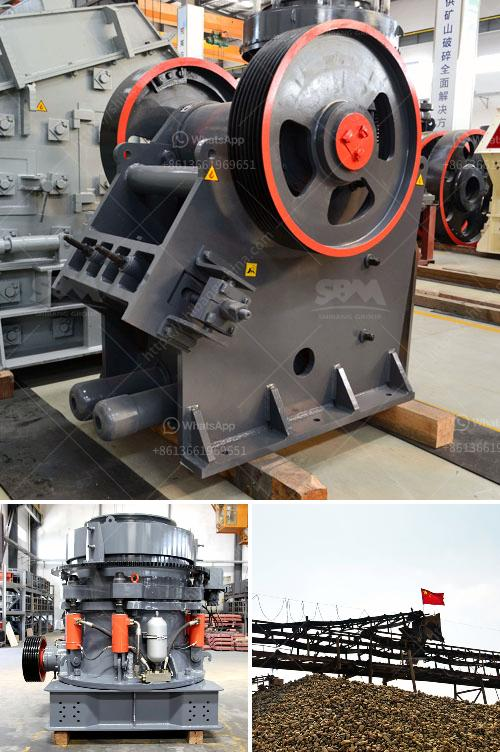

<h3>hammer mill production location in nigeria</h3>
Hammer mill production is immensely reliant on the location where it is established. Nigeria is fast becoming a major producer of high-quality hammer mills and its suppliers are gaining edge over the imported varieties. The market for hammer mills is increasing immensely in Nigeria due to rapid industrialization and technological advancements. Hammer mills are gradually dominating the market due to their cost-effectiveness, functional efficiency, and availability in diverse sizes and capacities.

One of the major factors that affect hammer mill production is the location where it is set up. Nigeria is a country with diverse agricultural products, hence the availability of raw materials for the production of hammer mills is abundant. This availability drastically reduces the cost of production and makes Nigerian-made hammer mills more affordable than their imported counterparts.

More so, setting up hammer mill production in Nigeria ensures easy access to a vast market. Nigeria has a huge population and a continuously growing middle class, who are constantly in need of quality and affordable agriculture processing equipment such as hammer mills. The local production of hammer mills allows for easy distribution and availability to meet the demands of the market. With a strong distribution network and strategic location, Nigerian manufacturers of hammer mills can efficiently cater to the needs of farmers and agribusinesses across the country.

Another advantage of setting up hammer mill production in Nigeria is the lower cost of maintenance and servicing. When manufacturers establish their production units within Nigeria, it becomes easier to source spare parts and raw materials, hence reducing the downtime of the machines. Additionally, the manufacturers can provide after-sales services to their customers promptly, ensuring uninterrupted operations and customer satisfaction.

Furthermore, the establishment of hammer mill production in Nigeria presents a great opportunity for employment generation. The hammer mill production process requires skilled manpower, and this can provide employment opportunities for the Nigerian youths. By creating gainful employment, the Nigerian government can address the issue of unemployment, encourage entrepreneurship, and boost the overall economy.

It is important to note that the government should provide the necessary support and incentives to manufacturers who are willing to establish hammer mill production units in Nigeria. This can come in the form of tax breaks, access to affordable financing, and provision of essential infrastructure. By creating a favorable business environment, the government can attract more investors into the hammer mill production sector, thereby boosting local production and reducing dependency on imported machines.

In conclusion, establishing hammer mill production in Nigeria can have significant positive impacts. It leads to cost-effective production, easy access to the market, low maintenance costs, employment generation, and overall economic development. The Nigerian government should encourage and support local manufacturers in this sector to further boost the agricultural and industrial growth of the nation.
<h3>Contact us</h3><ul><li><strong>Whatsapp:&nbsp;<a href="https://wa.me/8613661969651">+8613661969651</a></strong></li><li><a href="https://swt.shibang-china.com/?git&amp;zhl&amp;hammer mill production location in nigeria"><strong>Online Service(chat now)</strong></a></li></ul><h3>Related</h3><ul><li><a href='the vertical mill ireland information.md'>the vertical mill ireland information</a></li><li><a href='design and sizing of a gold processing plant pdf.md'>design and sizing of a gold processing plant pdf</a></li><li><a href='stone crushing company in philippines.md'>stone crushing company in philippines</a></li><li><a href='rod mill manufacturer in europe.md'>rod mill manufacturer in europe</a></li><li><a href='logo of stone crusher.md'>logo of stone crusher</a></li></ul>