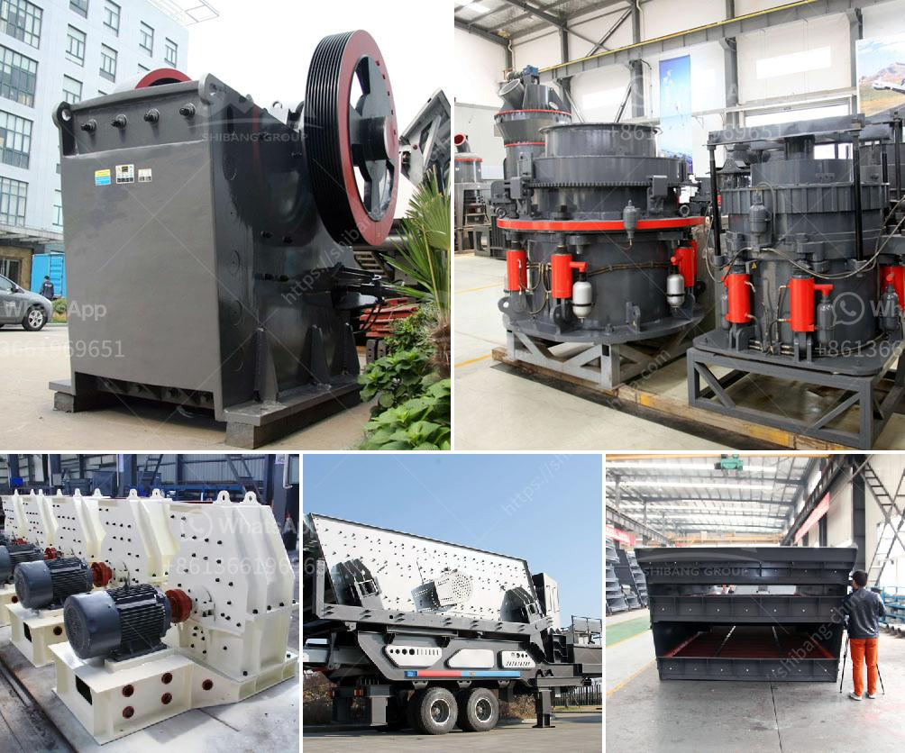

<h3>hammer mill santa cross</h3>
The Hammer Mill Santa Cross is an innovative machine that has become increasingly popular in various industries. This versatile equipment is designed to crush and pulverize a wide range of materials, making it an essential tool for businesses involved in recycling, composting, agriculture, and more.

One of the key features of the Hammer Mill Santa Cross is its ability to reduce the size of different materials quickly and efficiently. With its powerful motor and high-speed rotating hammers, it can crush everything from organic waste to construction debris. This makes the machine a valuable asset for companies looking to repurpose and recycle their waste products, reducing landfill waste and contributing to a more sustainable future.

The Santa Cross Hammer Mill is also widely used in the agricultural sector. Farmers often utilize this equipment to crush grains, hay, and other feed ingredients, making it easier for livestock to consume. By processing the feed, the nutrients become more accessible, improving the animals' overall health and productivity. Additionally, the machine can be used to pulverize crop residues, such as corn stalks or wheat straws, enabling their transformation into valuable organic matter for composting.

The Hammer Mill Santa Cross is not limited to recycling and agriculture. It is also used in mining, wood processing, and pharmaceutical industries. Its versatility lies in its ability to adapt to different materials and processes, making it an indispensable tool for many businesses.

Furthermore, the Santa Cross Hammer Mill is designed to be user-friendly and easy to maintain. Its robust construction ensures its durability, and it requires minimal maintenance, reducing downtime and increasing productivity.

In conclusion, the Hammer Mill Santa Cross is a versatile machine that has found its place in various industries. With its fast and efficient crushing abilities, it is an essential tool for recycling, composting, agriculture, and more. Its usage in different sectors highlights its adaptability and effectiveness. As businesses continue to prioritize sustainability and efficiency, the Santa Cross Hammer Mill is bound to remain in high demand for years to come.
<h3>Contact us</h3><ul><li><strong>Whatsapp:&nbsp;<a href="https://wa.me/8613661969651">+8613661969651</a></strong></li><li><a href="https://swt.shibang-china.com/?git&amp;zhl&amp;hammer mill santa cross"><strong>Online Service(chat now)</strong></a></li></ul><h3>Related</h3><ul><li><a href='manufacturer of vibrating screens.md'>manufacturer of vibrating screens</a></li><li><a href='stone crushing and screening plant.md'>stone crushing and screening plant</a></li><li><a href='gravel crusher for sale.md'>gravel crusher for sale</a></li><li><a href='river sand washing machine.md'>river sand washing machine</a></li><li><a href='copper ore processing.md'>copper ore processing</a></li></ul>