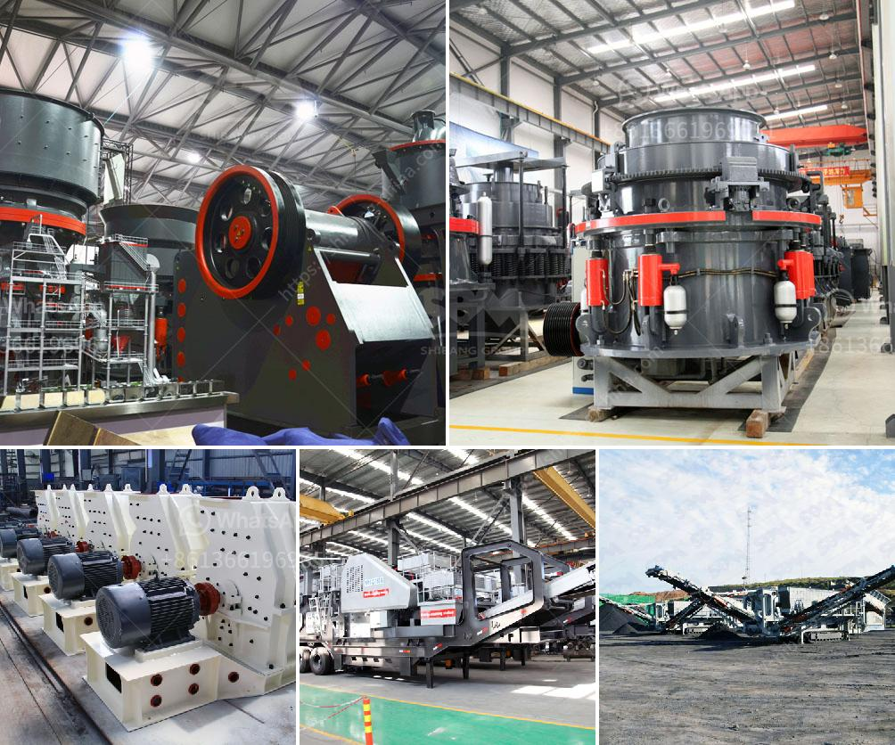

<h3>hammer mill supplers in bulawayo</h3>
Bulawayo, the second largest city in Zimbabwe, is regarded as the industrial hub of the country. The city plays a vital role in the mining industry, which has seen rapid growth over the years. As a result, there is an increasing demand for mining equipment specifically hammer mills that are used to crush and grind various materials.

Hammer mills are essential tools for the mining industry as they are designed to reduce the size of large, dense materials into smaller, more manageable particles. These mills have a high capacity to quickly crush and grind materials such as limestone, cement, ores, and minerals, making them ideal for mining operations. With the increasing demand for minerals and the expansion of mining activities in Zimbabwe, the need for reliable hammer mill suppliers in Bulawayo has become crucial.

Fortunately, there are several reputable hammer mill suppliers in Bulawayo that are dedicated to meeting the needs of the mining industry. These suppliers offer a wide range of hammer mills, catering to different mining operations and specific requirements. They provide mills with varying horsepower capacities, ensuring that miners have access to the perfect machine for their specific needs.

One of the top hammer mill suppliers in Bulawayo is ABC Machinery. This supplier has a reputation for offering high-quality mills that are durable, efficient, and reliable. ABC Machinery understands the importance of productivity in the mining industry and ensures that their mills are designed to deliver exceptional performance, enabling miners to optimize their operations. Their mills are also easy to maintain, saving time and reducing operational costs.

In addition to ABC Machinery, another prominent supplier in Bulawayo is Hammer Mill Manufacturers Africa (HMM). HMM offers a comprehensive range of mills that are suitable for various mining applications. They provide mills with innovative features such as adjustable hammers, screens, and different configurations to deliver efficient grinding capabilities. HMM also emphasizes on customer satisfaction by providing excellent after-sales service, ensuring that their clients have access to technical support and assistance when needed.

The presence of reliable hammer mill suppliers in Bulawayo is not only beneficial for the mining industry in Zimbabwe but also contributes to the overall economic growth of the country. These suppliers not only provide high-quality equipment but also create employment opportunities, offering skilled jobs to the local population. This, in turn, improves the standard of living and helps in reducing unemployment rates in the city.

Moreover, the availability of reliable hammer mill suppliers encourages the growth of small-scale mining operations. Small-scale miners play a significant role in the mining industry and contribute to the diversification of the economy. The access to efficient and reliable hammer mills enables these miners to process their minerals on-site, reducing the reliance on costly off-site processing facilities.

In conclusion, the mining industry in Bulawayo, Zimbabwe, greatly benefits from the presence of reputable hammer mill suppliers. These suppliers offer high-quality equipment, promote economic growth, and provide employment opportunities. Additionally, they empower small-scale miners, contributing to a vibrant and sustainable mining sector. With the increasing demand for mining equipment, the role of hammer mill suppliers in Bulawayo will remain vital in supporting the growth of the mining industry in Zimbabwe.
<h3>Contact us</h3><ul><li><strong>Whatsapp:&nbsp;<a href="https://wa.me/8613661969651">+8613661969651</a></strong></li><li><a href="https://swt.shibang-china.com/?git&amp;zhl&amp;hammer mill supplers in bulawayo"><strong>Online Service(chat now)</strong></a></li></ul><h3>Related</h3><ul><li><a href='gold washing equipment portable.md'>gold washing equipment portable</a></li><li><a href='granite mining machinery.md'>granite mining machinery</a></li><li><a href='gold ore processing equipment manufacturer.md'>gold ore processing equipment manufacturer</a></li><li><a href='jaw crusher for sale kenya.md'>jaw crusher for sale kenya</a></li><li><a href='vibrating machine for concrete.md'>vibrating machine for concrete</a></li></ul>