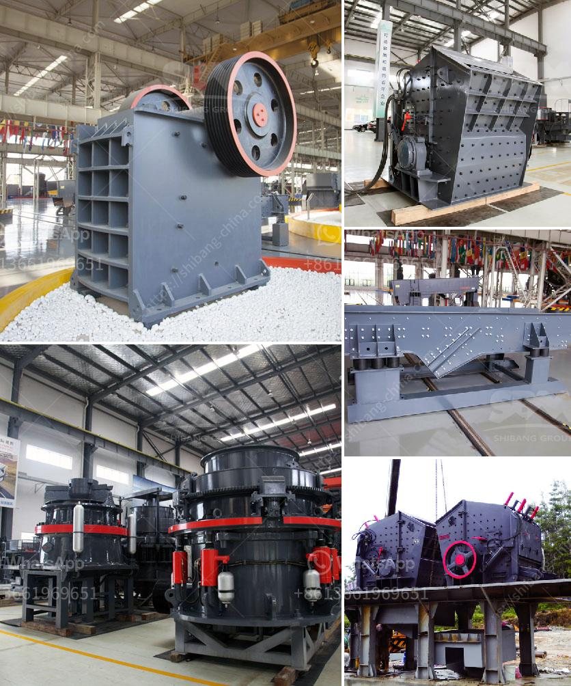

<h3>hammer mills for stone</h3>
Hammer mills for stone have been widely used in various industries for size reduction and processing raw materials. These machines are versatile and can be used for grinding, crushing, and shredding a wide range of materials, including limestone, shale, gypsum, phosphate rock, glass, and more.

The basic design of a hammer mill consists of a rotating shaft with free-swinging hammers attached to it. As the shaft rotates, the hammers strike the material, pulverizing it into particles of uniform size. The size of the final product depends on the size of the openings in the screen or grate surrounding the grinding chamber.

One of the advantages of using a hammer mill for stone processing is its ability to produce a wide range of particle sizes. This flexibility is essential in industries such as agriculture, where different feed sizes are required for various livestock and poultry. Furthermore, in the construction industry, different particle sizes are needed for different applications, such as concrete, road base, and asphalt.

Another advantage of hammer mills is their ability to handle both dry and wet materials. This makes them suitable for processing moisture-rich materials, eliminating the need for additional drying equipment. Additionally, hammer mills are known for their high throughput rates, allowing for efficient processing of large quantities of stone in a short period.

Maintenance and operation of hammer mills for stone are relatively simple. Regular inspection and cleaning of the grinding chamber and changing screens or grates when needed ensure optimal performance and extend the machine's lifespan. Safety measures, such as wearing appropriate personal protective equipment and proper training, should also be followed to avoid accidents.

In conclusion, hammer mills for stone are a valuable tool in various industries. Their ability to produce a wide range of particle sizes, handle both dry and wet materials, and high throughput rates make them an efficient choice for stone processing. By following proper maintenance and safety protocols, these machines can provide consistent and reliable results for many years.
<h3>Contact us</h3><ul><li><strong>Whatsapp:&nbsp;<a href="https://wa.me/8613661969651">+8613661969651</a></strong></li><li><a href="https://swt.shibang-china.com/?git&amp;zhl&amp;hammer mills for stone"><strong>Online Service(chat now)</strong></a></li></ul><h3>Related</h3><ul><li><a href='crusher machine price.md'>crusher machine price</a></li><li><a href='rock crusher alibaba.md'>rock crusher alibaba</a></li><li><a href='copper ore processing.md'>copper ore processing</a></li><li><a href='3 roll mills machine manufacturers in europe.md'>3 roll mills machine manufacturers in europe</a></li><li><a href='second hand vrm cement mill for sale.md'>second hand vrm cement mill for sale</a></li></ul>