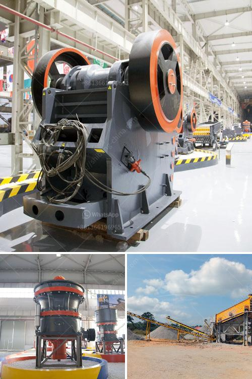

<h3>hammer mills produced in brazil</h3>
Brazil, known for its abundant natural resources, is not only a major agricultural powerhouse but also a leading producer of industrial machinery and equipment. In recent years, the country has witnessed a significant growth in the manufacturing and export of hammer mills, a versatile machine that plays a crucial role in various industries. With its capacity to finely grind or pulverize materials, the hammer mill has become an essential tool for many Brazilian businesses.

Hammer mills are commonly used in the agricultural sector to process grains and fodder, facilitating animal feed preparation. As Brazil boasts an enormous livestock industry, the demand for high-quality animal feed is ever-increasing. Hammer mills ensure that grains are efficiently transformed into a consistent and digestible form, maximizing their nutritive value.

Brazil's thriving biofuel industry is another sector that heavily relies on hammer mills for the production of biomass pellets and briquettes. These energy-dense materials play a crucial role in substituting traditional fossil fuels and reducing greenhouse gas emissions. Hammer mills have proved to be indispensable in the transformation of agricultural residues, such as sugarcane bagasse and corn stalks, into valuable biofuels, promoting sustainable energy practices.

Moreover, hammer mills have found applications in the pharmaceutical and chemical industries, where they are utilized for the fine grinding of various compounds and substances. The ability to control the particle size with precision makes hammer mills an ideal choice for producing medications, chemicals, and even specialty ingredients for the food industry.

Brazil's prowess in manufacturing hammer mills can be attributed to the country's rich engineering expertise and continuous investment in research and development. Brazilian manufacturers have focused on producing innovative and efficient designs, addressing the specific needs of different industries. Their machines boast high performance, durability, and ease of maintenance, ensuring long-term reliability for businesses.

With a strong domestic market, Brazilian hammer mill manufacturers have also expanded their reach to global markets. Their competitiveness in terms of price and quality has made Brazil a prominent player in the international hammer mill industry. Manufacturers often prioritize sustainability, incorporating energy-efficient features into their designs and using eco-friendly materials.

As the demand for hammer mills continues to grow, Brazil's thriving manufacturing sector is poised to meet domestic and international market needs. The country's superior engineering standards, commitment to innovation, and dedication to sustainable practices have cemented its position as a leading producer of hammer mills. With Brazil's hammer mills, businesses worldwide can benefit from efficient and reliable equipment, contributing to the growth and efficiency of various industries.
<h3>Contact us</h3><ul><li><strong>Whatsapp:&nbsp;<a href="https://wa.me/8613661969651">+8613661969651</a></strong></li><li><a href="https://swt.shibang-china.com/?git&amp;zhl&amp;hammer mills produced in brazil"><strong>Online Service(chat now)</strong></a></li></ul><h3>Related</h3><ul><li><a href='gold corporation ball mill.md'>gold corporation ball mill</a></li><li><a href='small impact gold mill australia.md'>small impact gold mill australia</a></li><li><a href='roller machines for milling.md'>roller machines for milling</a></li><li><a href='start a stone crusher.md'>start a stone crusher</a></li><li><a href='mini crusher hire johannesburg.md'>mini crusher hire johannesburg</a></li></ul>