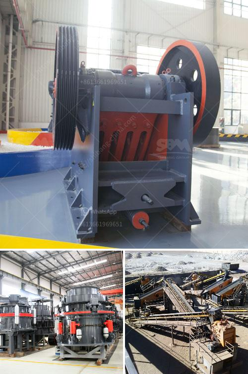

<h3>harga jaw crusher</h3>
The jaw crusher is an essential piece of machinery in any construction site, mining operation, or stone crushing plant. It allows for the crushing of rocks into gravel, smaller rocks, or even miniscule dust particles. With a harga jaw crusher, you can get the job done effectively and efficiently. 

Firstly, let's understand what exactly a jaw crusher is. A jaw crusher is a compression-type crusher that consists of a fixed jaw and a moving jaw. The fixed jaw is mounted on an integral frame, while the moving jaw is attached to a pitman that is driven by an eccentric shaft. As the material enters the crushing chamber, it gets crushed between the fixed and moving jaw. This ensures that the material is reduced in size and able to pass through the opening at the bottom of the crusher.

One of the key benefits of a jaw crusher is its versatility. It can be used for a wide range of applications, from primary crushing to final sizing. Whether you need to crush large rocks or small particles, a jaw crusher can handle it all. Its adjustable settings allow for precise control over the final product size, making it highly desirable for various industries.

When it comes to choosing a jaw crusher, the harga or price is an important consideration. The cost of a jaw crusher varies depending on the features and specifications. Generally, the higher the capacity and the larger the feed opening, the higher the price. However, it's important to note that a higher price doesn't necessarily mean better quality. It's essential to find a balance between price and performance to ensure you're getting the best value for your investment.

There are several factors to consider when determining the appropriate harga jaw crusher for your needs. Firstly, evaluate your production requirements. How much material do you need to process? What is the desired final product size? Understanding these factors will help you determine the capacity and size of the jaw crusher you need.

Additionally, consider the feed size and hardness of the material. A jaw crusher with a larger feed opening can accept larger rocks, while a jaw crusher with a smaller feed opening is better suited for smaller particles. The hardness of the material also affects the choice of jaw crusher. Harder materials require stronger and more robust crushers to withstand the pressure and abrasive forces.

To conclude, investing in a harga jaw crusher is a wise choice for any industry that requires effective and efficient crushing solutions. Its versatility, adjustable settings, and ability to handle a wide range of materials make it an invaluable tool. Just make sure to carefully evaluate your requirements and consider factors such as capacity, feed size, and hardness when selecting the appropriate jaw crusher. By doing so, you'll ensure that you're getting the best value for your investment and achieving the desired results.
<h3>Contact us</h3><ul><li><strong>Whatsapp:&nbsp;<a href="https://wa.me/8613661969651">+8613661969651</a></strong></li><li><a href="https://swt.shibang-china.com/?git&amp;zhl&amp;harga jaw crusher"><strong>Online Service(chat now)</strong></a></li></ul><h3>Related</h3><ul><li><a href='gold hammer mill used for sale in zimbabwe.md'>gold hammer mill used for sale in zimbabwe</a></li><li><a href='quarry crusher in zambia.md'>quarry crusher in zambia</a></li><li><a href='crushing plant in pangasinan.md'>crushing plant in pangasinan</a></li><li><a href='used coal grinding machine for sale in usa.md'>used coal grinding machine for sale in usa</a></li><li><a href='indonesia vertical grinding machine.md'>indonesia vertical grinding machine</a></li></ul>