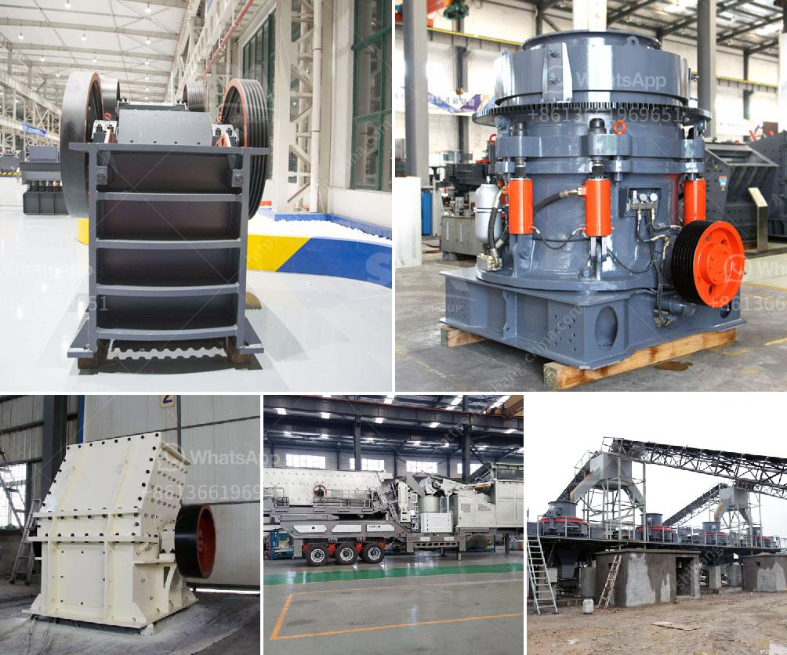

<h3>harga mesin raymond mill indonesia</h3>
Raymond mill is a common grinding equipment used in the field of non-metallic mineral grinding. Its grinding efficiency is high and it has the characteristics of energy saving, wide fineness adjustment range, and easy maintenance. Recently, the price of Raymond mill in Indonesia is rising. The reason for this situation is that the new policies implemented by the Indonesian government have greatly increased the market demand for Raymond mill.

Firstly, the Indonesian government has implemented a series of measures to support the development of domestic mining and mineral processing industries, including reducing taxes and fees for mining companies and encouraging the use of local equipment and materials. This has greatly stimulated the development of the mining industry and increased the demand for grinding equipment such as Raymond mill.

Secondly, as the Indonesian government pays more attention to environmental protection, the local mineral processing industry is required to improve its level of green and sustainable development. Raymond mill, as a high-efficiency and low-pollution grinding equipment, has become the preferred equipment for many companies. Therefore, the demand for Raymond mill in Indonesia has increased significantly.

In addition, the increase in the purchasing power of Indonesian residents has also led to an increase in the demand for non-metallic minerals, such as limestone, marble, and quartz. These minerals are widely used in construction, coatings, plastics, and other industries, which require finely ground materials. Raymond mill, with its advantages of high fineness and good particle shape, has become an essential grinding equipment for processing these minerals.

However, as the demand for Raymond mill increases, the price of Raymond mill in Indonesia has also risen. The factors affecting the price of Raymond mill are mainly reflected in the following aspects:

1. Raw material cost: The price of Raymond mill is closely related to the cost of raw materials such as steel and parts. With the continuous increase in the price of raw materials, the price of Raymond mill will inevitably rise.

2. Labor cost: As wages and various expenses in Indonesia continue to rise, the labor cost of Raymond mill manufacturers has also increased, which will be reflected in the price of Raymond mill.

3. Exchange rate fluctuations: As the price of Raymond mill mainly depends on the equipment exported from China, the exchange rate between China and Indonesia will directly affect the price of Raymond mill. If the Indonesian rupiah depreciates, the price of Raymond mill will rise accordingly.

In conclusion, the price of Raymond mill in Indonesia has been on the rise due to the increasing demand for grinding equipment in the domestic mining and mineral processing industries. Factors such as raw material cost, labor cost, and exchange rate fluctuations have all contributed to the increase in the price of Raymond mill. However, despite the rise in price, the advantages of Raymond mill, such as high efficiency and energy saving, make it still attractive to many customers.
<h3>Contact us</h3><ul><li><strong>Whatsapp:&nbsp;<a href="https://wa.me/8613661969651">+8613661969651</a></strong></li><li><a href="https://swt.shibang-china.com/?git&amp;zhl&amp;harga mesin raymond mill indonesia"><strong>Online Service(chat now)</strong></a></li></ul><h3>Related</h3><ul><li><a href='small scale mining plant philippines diagram.md'>small scale mining plant philippines diagram</a></li><li><a href='limestone ball mill in egypt.md'>limestone ball mill in egypt</a></li><li><a href='sales of conveyor belts.md'>sales of conveyor belts</a></li><li><a href='dolomite beneficiation process.md'>dolomite beneficiation process</a></li><li><a href='traditional crushing machine.md'>traditional crushing machine</a></li></ul>