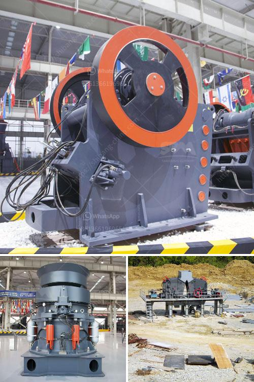

<h3>harga stone cruser bekas dijual</h3>
Dijual or "for sale" in the Indonesian language, harga stone cruser bekas dijual refers to the price and availability of used stone crushers in the market. Stone crushing industry has been a crucial factor in Indonesia's economic growth and development, contributing significantly to the country's GDP.

Buying a used stone crusher can be a wise investment for several reasons. Firstly, it is a cost-effective option compared to purchasing a brand-new crusher. Used crushers are generally priced lower than new ones, allowing buyers to save money. Moreover, used stone crushers are readily available in the market, providing a wide range of options for buyers to choose from.

Secondly, buying a used stone crusher allows buyers to acquire high-quality equipment at a lower price. Many used stone crushers are still in excellent working condition, even after years of use. This is because stone crushers are built to withstand heavy-duty operations and are designed to last for a long time. Hence, buyers can be confident that they are investing in a durable and reliable machine.

Thirdly, the availability of used stone crushers in the market ensures quick and easy access to these machines. Buyers do not have to wait for the manufacturing process or deal with long lead times before receiving the equipment. They can simply find a suitable used stone crusher that meets their requirements and purchase it immediately.

Lastly, buying a used stone crusher allows buyers to contribute to sustainable practices. By recycling and reusing existing machinery, buyers can reduce their carbon footprint and minimize waste. This is especially important in a world increasingly concerned about environmental conservation.

In conclusion, harga stone cruser bekas dijual, or the price of used stone crushers for sale, offers numerous benefits to buyers. It is a cost-effective option, offers high-quality equipment, ensures quick access, and promotes sustainable practices. Whether for personal or business use, investing in a used stone crusher is a wise decision that can yield great returns.
<h3>Contact us</h3><ul><li><strong>Whatsapp:&nbsp;<a href="https://wa.me/8613661969651">+8613661969651</a></strong></li><li><a href="https://swt.shibang-china.com/?git&amp;zhl&amp;harga stone cruser bekas dijual"><strong>Online Service(chat now)</strong></a></li></ul><h3>Related</h3><ul><li><a href='gypsum board making plant from germany.md'>gypsum board making plant from germany</a></li><li><a href='pulveriser quartzite china make.md'>pulveriser quartzite china make</a></li><li><a href='crusher manufacturer in pakistan.md'>crusher manufacturer in pakistan</a></li><li><a href='ball mill in ceramic industry.md'>ball mill in ceramic industry</a></li><li><a href='processing of delomite powder mill.md'>processing of delomite powder mill</a></li></ul>