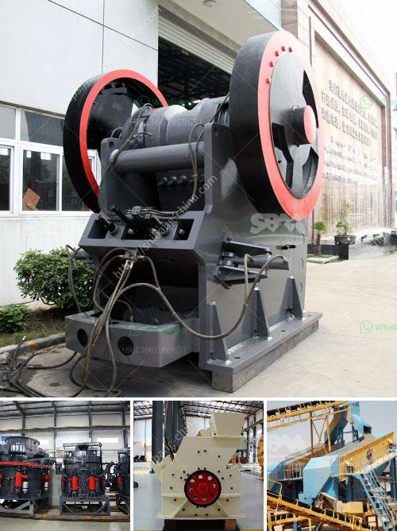

<h3>high capacity ball mill malaysia</h3>
The high-capacity ball mill industry in Malaysia is experiencing tremendous growth in recent years. The rapid urbanization and industrialization of the country have contributed to the growth of this industry. Moreover, the construction and infrastructure projects initiated by the government have fueled the demand for high-capacity ball mills.

A ball mill is a type of grinder used to grind materials into extremely fine powder for use in mineral dressing processes, paints, pyrotechnics, ceramics, and selective laser sintering. It works on the principle of impact and attrition: size reduction is done by impact as the balls drop from near the top of the shell.

In Malaysia, the high-capacity ball mill industry serves a wide range of industries including mining, construction, and chemicals. Ball mills are crucial equipment for grinding after materials have been crushed and are often used for secondary grinding in wet or dry applications.

One of the key factors driving the growth of this industry in Malaysia is the increasing demand for high-quality grinding media. Grinding media are the materials such as steel balls and ceramic beads used to grind and pulverize the material being processed. The quality of the grinding media directly affects the efficiency and performance of the ball mill.

To meet the growing demand for high-quality grinding media, manufacturers in Malaysia are investing in advanced technology and machinery. They are leveraging the latest manufacturing techniques to produce ball mills with high capacity and efficiency. These ball mills are designed to handle large volumes of material and deliver consistent and reliable results.

The high-capacity ball mills manufactured in Malaysia adhere to international quality standards. They are built with robust materials and components to ensure long-lasting performance even in the most demanding environments. Furthermore, these mills are equipped with advanced automation systems that improve operational efficiency and reduce downtime.

In addition to the manufacturing of ball mills, Malaysia is also a prominent hub for the import and export of grinding media. The country's strategic location and well-established trade routes make it an ideal distribution center for grinding media across the region. Manufacturers in Malaysia are keenly aware of this advantage and are working towards expanding their trading networks.

The high-capacity ball mill industry in Malaysia offers significant job opportunities and economic growth to the country. The production and distribution of ball mills and grinding media create a ripple effect in various related sectors, including logistics, transportation, and service industries. The growth of this industry not only contributes to the overall economic development of Malaysia but also boosts its stature as a manufacturing and trading powerhouse in the region.

In conclusion, the high-capacity ball mill industry in Malaysia is experiencing remarkable growth, fueled by the construction and infrastructure projects in the country. The demand for high-quality grinding media has led to the development of advanced ball mills that can handle large volumes of material and deliver efficient grinding results. Malaysia's strategic location and well-established trade routes further enhance its position as a hub for the import and export of grinding media. The growth of this industry brings numerous job opportunities and economic benefits to the country, making it an integral part of Malaysia's manufacturing and trading landscape.
<h3>Contact us</h3><ul><li><strong>Whatsapp:&nbsp;<a href="https://wa.me/8613661969651">+8613661969651</a></strong></li><li><a href="https://swt.shibang-china.com/?git&amp;zhl&amp;high capacity ball mill malaysia"><strong>Online Service(chat now)</strong></a></li></ul><h3>Related</h3><ul><li><a href='stone crushers manufacturer.md'>stone crushers manufacturer</a></li><li><a href='mineral material crusher.md'>mineral material crusher</a></li><li><a href='stone crusher plant cost saudi.md'>stone crusher plant cost saudi</a></li><li><a href='crusher primary cone crusher.md'>crusher primary cone crusher</a></li><li><a href='puzolana 250 tph crusher.md'>puzolana 250 tph crusher</a></li></ul>