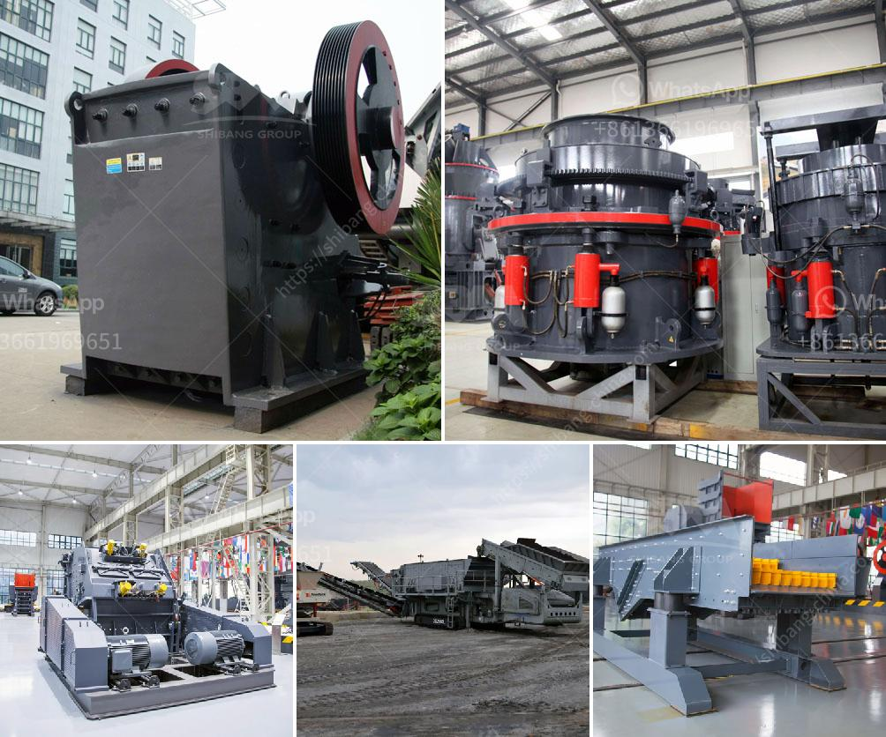

<h3>high chrome impact crusher spare parts</h3>
The impact crusher is a versatile machinery used for crushing various minerals and hard materials. Thanks to its robust construction, high production capacity, and adjustable performance, it is widely used in the mining, construction, and recycling industries. To enhance the efficiency of this powerful machine, it is important to use high-quality spare parts, especially high chrome impact crusher spare parts.

High chrome impact crusher spare parts play a crucial role in the crushing process. These parts are used to crush the material and ensure the proper functioning of the machine. They are designed to withstand high impact and abrasion, making them ideal for crushing hard and abrasive materials. The high chrome material used in these spare parts offers exceptional wear resistance, ensuring long-lasting performance and reducing downtime.

One of the key advantages of using high chrome impact crusher spare parts is their ability to improve the efficiency of the entire crushing process. The high chrome material provides a higher crushing ratio, enabling the machine to crush the material more efficiently. This results in a higher production capacity and a reduction in operating costs. Additionally, the high wear resistance of the spare parts guarantees a longer service life, reducing the need for frequent replacements and minimizing downtime.

Another advantage of high chrome impact crusher spare parts is their versatility. These spare parts are available in various shapes and sizes, allowing them to be used in different types of impact crushers. Whether it is a horizontal shaft impact crusher or a vertical shaft impact crusher, high chrome spare parts can be customized to fit the specific requirements of the machine. This flexibility ensures that the impact crusher operates at its optimum level, delivering maximum productivity and efficiency.

In conclusion, high chrome impact crusher spare parts are essential for enhancing the efficiency of crushing operations. By utilizing these high-quality spare parts, the impact crusher can deliver higher production capacities, reduce operating costs, and minimize downtime. Furthermore, their versatility allows them to be used in different types of impact crushers, ensuring optimum performance. Investing in high chrome impact crusher spare parts is a smart choice for any operator looking to maximize their crushing efficiency.
<h3>Contact us</h3><ul><li><strong>Whatsapp:&nbsp;<a href="https://wa.me/8613661969651">+8613661969651</a></strong></li><li><a href="https://swt.shibang-china.com/?git&amp;zhl&amp;high chrome impact crusher spare parts"><strong>Online Service(chat now)</strong></a></li></ul><h3>Related</h3><ul><li><a href='how to calculate grinding media in cement mill.md'>how to calculate grinding media in cement mill</a></li><li><a href='chrome ore refinery processing plant.md'>chrome ore refinery processing plant</a></li><li><a href='kaolin crusher production costs.md'>kaolin crusher production costs</a></li><li><a href='coal crusher machine capacity of 5 tons an hour.md'>coal crusher machine capacity of 5 tons an hour</a></li><li><a href='consultants to help to start a stone crusher.md'>consultants to help to start a stone crusher</a></li></ul>