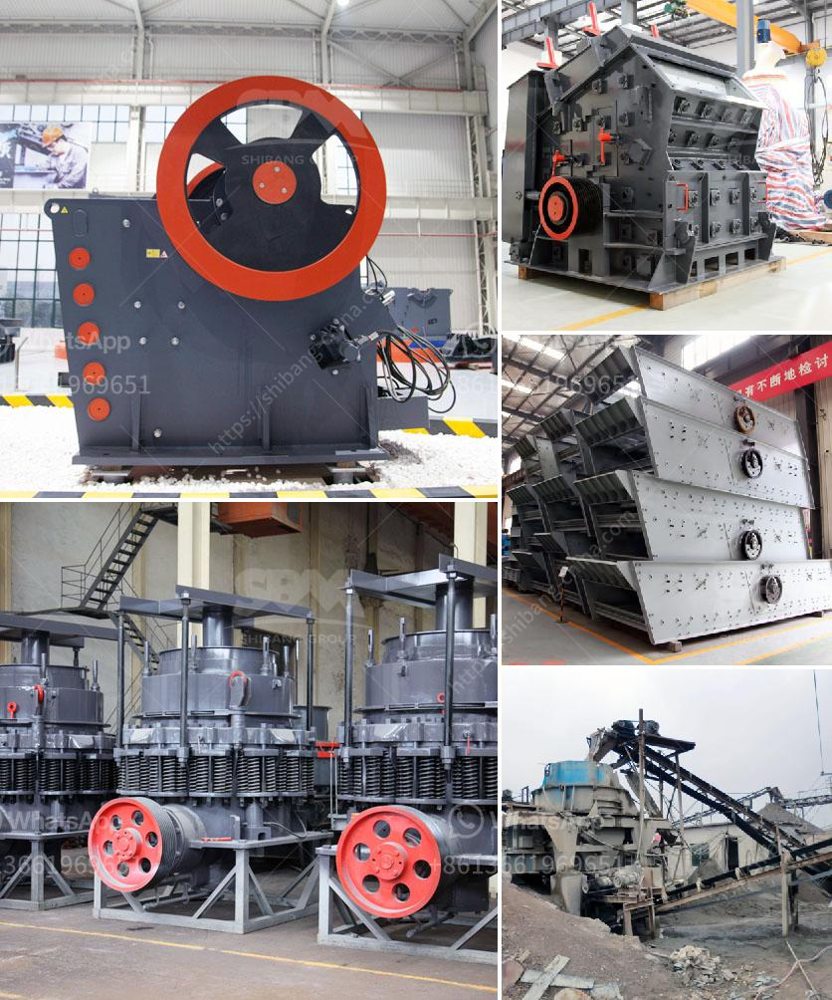

<h3>high performance mobile crushing machine for sale</h3>
In today's fast-paced world, efficiency and productivity are key factors when it comes to any project or operation. This is especially true in the construction, mining, and quarrying industries, where crushing machines play a crucial role in the processing of materials. With the advent of high-performance mobile crushing machines, these industries have experienced a significant boost in their overall productivity and efficiency.

Mobile crushing machines are designed to process a variety of materials, ranging from construction waste to quarry rock. They are compact in size, making them highly suitable for working on tight job sites where space is limited. These machines are mounted on a track or truck, allowing for easy transportation between different work locations. Furthermore, they are equipped with advanced features that ensure optimal performance and versatility.

One of the key advantages of mobile crushing machines is their ability to move from one location to another. Traditional crushing machines require materials to be transported to a fixed plant, which can be time-consuming and costly. In contrast, mobile crushers can be brought directly to the site, reducing time and transportation costs. This mobility also allows for efficient processing of materials in different areas, minimizing downtime and maximizing productivity.

Another factor that sets high-performance mobile crushing machines apart is their power and capacity. These machines are equipped with powerful engines and high-performance crushers, enabling them to process large quantities of materials at a rapid pace. This means increased production rates, faster project completion times, and higher overall profitability. Additionally, these machines are designed to handle a wide range of materials, allowing for versatility in various applications.

Furthermore, high-performance mobile crushing machines incorporate advanced features that optimize their efficiency. For instance, they are equipped with intelligent control systems that monitor and regulate the crushing process. This ensures uniform product sizing, reduced wear and tear on the crushers, and increased energy efficiency. Some machines also feature remote monitoring capabilities, enabling operators to track performance and make adjustments in real-time, regardless of their location.

The durability and reliability of high-performance mobile crushing machines are also key factors contributing to their popularity. These machines are built to withstand harsh working conditions, such as extreme temperatures, dust, and vibrations. They are constructed from high-quality materials and undergo rigorous testing to ensure long-lasting performance. This means less downtime due to maintenance and repairs, resulting in increased uptime and improved profitability.

In conclusion, high-performance mobile crushing machines have revolutionized the construction, mining, and quarrying industries. Their compact design, mobility, and powerful performance make them ideal for various applications. Their ability to process materials on-site reduces costs and saves time, while their advanced features maximize efficiency and productivity. If you are in the market for a crushing machine, consider investing in a high-performance mobile unit to streamline your operations and enhance profitability.
<h3>Contact us</h3><ul><li><strong>Whatsapp:&nbsp;<a href="https://wa.me/8613661969651">+8613661969651</a></strong></li><li><a href="https://swt.shibang-china.com/?git&amp;zhl&amp;high performance mobile crushing machine for sale"><strong>Online Service(chat now)</strong></a></li></ul><h3>Related</h3><ul><li><a href='impact crusher china.md'>impact crusher china</a></li><li><a href='small scale gold milling and processing plant.md'>small scale gold milling and processing plant</a></li><li><a href='ball mill cost estimate for mining plant.md'>ball mill cost estimate for mining plant</a></li><li><a href='coal handling coal transfer by conveyors coal crusher.md'>coal handling coal transfer by conveyors coal crusher</a></li><li><a href='21 10 jaw crusher price in south afirca.md'>21 10 jaw crusher price in south afirca</a></li></ul>