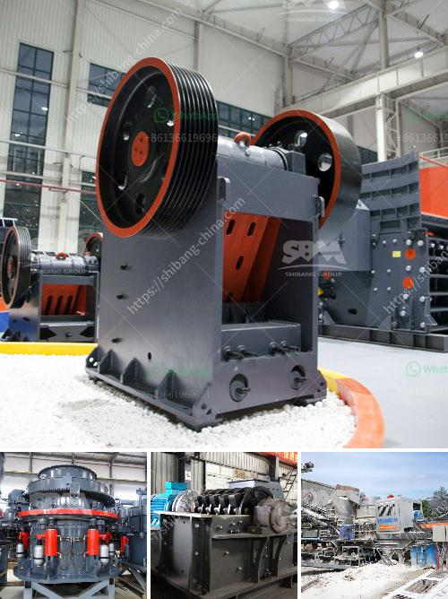

<h3>high speed hand powder crushing machine</h3>
When it comes to grinding and crushing powders, traditional methods can be time-consuming and laborious. However, thanks to the development of advanced technology, the introduction of high-speed hand powder crushing machines has brought about a revolutionary change in this industry. These machines offer a quick and efficient solution to grind various substances into fine powders, with minimal effort required.

One of the key features of these high-speed hand powder crushing machines is their exceptional speed and power. Equipped with powerful motors and sharp blades, these machines can crush any substance in a matter of seconds. Whether it is herbs, spices, or even hard substances like bones, these machines can effectively transform them into finely ground powders with just a few simple motions.

The compact and lightweight design of these machines makes them easy to handle and portable, which is an added advantage. This allows users to conveniently carry them anywhere, whether it is a commercial kitchen, a laboratory, or even outdoor settings. Additionally, their user-friendly controls and intuitive interface make them accessible for all levels of users, from culinary professionals to hobbyists.

Furthermore, the high-speed hand powder crushing machines are designed to ensure maximum safety. They come with protective guards and locking mechanisms that prevent any accidents during usage. Additionally, the materials used in their construction are often durable and resistant to corrosion, ensuring a long lifespan and trouble-free operation.

The versatility of these machines is another remarkable aspect. They can efficiently crush different substances, ranging from spices for culinary purposes to medicines for pharmaceutical applications. Moreover, they can be easily adjusted to obtain the desired consistency of the powder, making them suitable for a wide range of needs.

In conclusion, the introduction of high-speed hand powder crushing machines has revolutionized the grinding and crushing industry. With their exceptional speed, power, and convenience, these machines offer a quick and efficient solution for transforming substances into fine powders. Whether it is for culinary, pharmaceutical, or scientific purposes, these machines are a game-changer that simplifies the process and enhances productivity. Say goodbye to the days of cumbersome grinding methods - embrace the future of efficient powder crushing with these innovative machines!
<h3>Contact us</h3><ul><li><strong>Whatsapp:&nbsp;<a href="https://wa.me/8613661969651">+8613661969651</a></strong></li><li><a href="https://swt.shibang-china.com/?git&amp;zhl&amp;high speed hand powder crushing machine"><strong>Online Service(chat now)</strong></a></li></ul><h3>Related</h3><ul><li><a href='pictures of coal mining equipment.md'>pictures of coal mining equipment</a></li><li><a href='list gold mining equipment and machines.md'>list gold mining equipment and machines</a></li><li><a href='lm vertical grinding mills.md'>lm vertical grinding mills</a></li><li><a href='output size of stone crusher machine.md'>output size of stone crusher machine</a></li><li><a href='chromite ore beneficiation processing.md'>chromite ore beneficiation processing</a></li></ul>