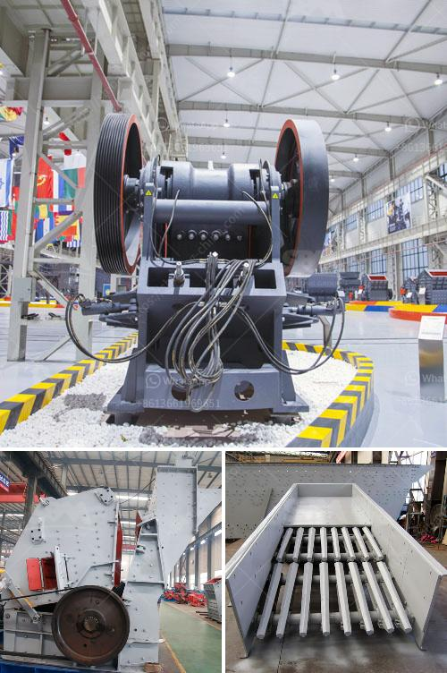

<h3>how does a jaw crusher limestone</h3>
A jaw crusher is essentially a machine that processes large rocks into smaller sizes. The jaw crusher reduces the size of limestone rocks by crushing them into small pieces. These small pieces are then transported to the desired end-use locations. Besides crushing limestone, the jaw crusher can also be used to crush granite, basalt, gravel, and various other stones.

Limestone plays a crucial role in many industries, providing essential raw material to the construction, agricultural, chemical, and industrial sectors. With its various applications, limestone is in high demand. To meet this demand, a reliable crushing solution like a jaw crusher is necessary.

The process of crushing limestone with a jaw crusher involves feeding the material into the chamber to be crushed, applying a compressive force that breaks the particles, and discharging the crushed product. This process is repeated until the desired size of the limestone is achieved.

One of the key benefits of using a jaw crusher for crushing limestone is its efficiency. A jaw crusher has a larger crushing chamber than other crushers, allowing it to process more material at once. This means that a jaw crusher can save time and energy when crushing large quantities of limestone.

Another advantage of using a jaw crusher is its versatility. A jaw crusher can be used to crush various types of stones, making it a suitable choice for many different applications. Whether it is used in construction, agriculture, or industrial settings, a jaw crusher can efficiently process limestone and other rocks.

Furthermore, a jaw crusher is easy to operate and maintain. It has a simple design with fewer moving parts, reducing the risk of mechanical failures. This reduces downtime and increases the productivity of the equipment. Regular maintenance and proper lubrication can prolong the lifespan of a jaw crusher, ensuring optimal performance for a longer period.

When choosing a jaw crusher for crushing limestone, several factors should be considered. The size and hardness of the limestone should be assessed to select the appropriate jaw crusher model for the job. The desired output size, production capacity, and required end-use specifications are also important considerations.

In conclusion, a jaw crusher is a reliable and efficient solution for crushing limestone and other rocks. Its efficiency, versatility, and ease of operation make it a popular choice in various industries. The use of a jaw crusher can save time, energy, and resources while meeting the demand for limestone in construction, agriculture, chemical, and industrial applications. When selecting a jaw crusher, factors such as limestone size, hardness, output size, production capacity, and end-use requirements should be considered to ensure optimal results.
<h3>Contact us</h3><ul><li><strong>Whatsapp:&nbsp;<a href="https://wa.me/8613661969651">+8613661969651</a></strong></li><li><a href="https://swt.shibang-china.com/?git&amp;zhl&amp;how does a jaw crusher limestone"><strong>Online Service(chat now)</strong></a></li></ul><h3>Related</h3><ul><li><a href='gypsum grinding machine suppliers.md'>gypsum grinding machine suppliers</a></li><li><a href='full crushing plants germiston.md'>full crushing plants germiston</a></li><li><a href='mining equipment for sale in japan.md'>mining equipment for sale in japan</a></li><li><a href='crusher for sale in kerala.md'>crusher for sale in kerala</a></li><li><a href='cube crushing machine.md'>cube crushing machine</a></li></ul>