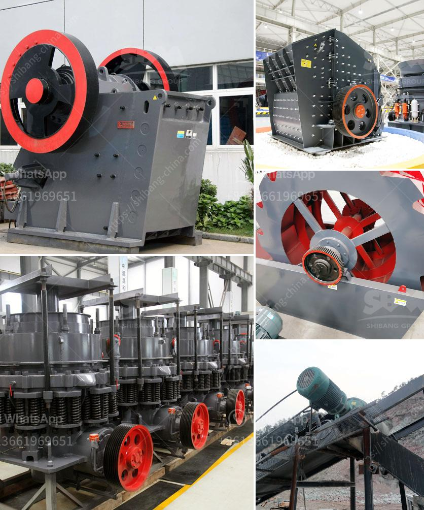

<h3>how does a stone crushing plant work</h3>
Stone Crushing Plant, commonly known as rock crushing plant, is the combination of various types of equipment to meet different process requirements. It could be classified into two variations: semi-portable stone crushing plant and tracked crusher, according to the way it moves down roads.

The semi-portable crusher can be moved as needed with the help of a truck and the tractor trailer. Once it arrives at the job site, it can be easily set up for operation within just a few hours. The track-mounted stone crushing plant is capable of crushing 200 to 300 tph with a weight of 56 tonnes. With its two-tonne jaw crusher, the machine is capable of crushing large rocks into gravels effectively.

When working, stones are sent into the crushing machine, which trips up the material and sends it back onto the resistance plate/screen. This process is repeated until the material is crushed to the desired particle size and discharged through the appropriate discharge port. The crushed stone materials are conveyed to a vibrating screen via a belt conveyor for filtration.

The vibrating screen separates crushed materials according to their size. Materials that satisfy the required particle size are transported to the final product pile through the conveyer belt for storage. Oversized materials are sent back into the crushing machine for further crushing until they reach the desired size.

-It is highly automated and requires fewer workers. In addition to reducing labor costs, it also improves working conditions, productivity, and encourages safe practices.

-The maintenance costs are significantly reduced because only necessary maintenance and minor repairs are required. The downtime due to unexpected equipment failure is rare.

-It achieves superior production efficiency for users, offering a variety of output sizes with excellent particle shape.

-It is environmentally friendly with low dust and noise pollution. The noise generated during the operation is relatively low, making it suitable for urban areas.

-It has a wide range of applications due to its adaptability for different materials, making it ideal for various construction projects.

In conclusion, the stone crushing plant refers to the dedicated device used for the construction sand and stone production. Compared with the traditional sand making production line, its environment friendliness makes it widely applied in the engineering constructions of stone plant, mine, metallurgy, construction materials, highway and railway and water conversancy.
<h3>Contact us</h3><ul><li><strong>Whatsapp:&nbsp;<a href="https://wa.me/8613661969651">+8613661969651</a></strong></li><li><a href="https://swt.shibang-china.com/?git&amp;zhl&amp;how does a stone crushing plant work"><strong>Online Service(chat now)</strong></a></li></ul><h3>Related</h3><ul><li><a href='quartz stone powder.md'>quartz stone powder</a></li><li><a href='stone crusher nigeria.md'>stone crusher nigeria</a></li><li><a href='mobile crushing plant for rent in saudi arabia.md'>mobile crushing plant for rent in saudi arabia</a></li><li><a href='gold washer machine manufacturer.md'>gold washer machine manufacturer</a></li><li><a href='hydro sizing silica sand crusher plant.md'>hydro sizing silica sand crusher plant</a></li></ul>