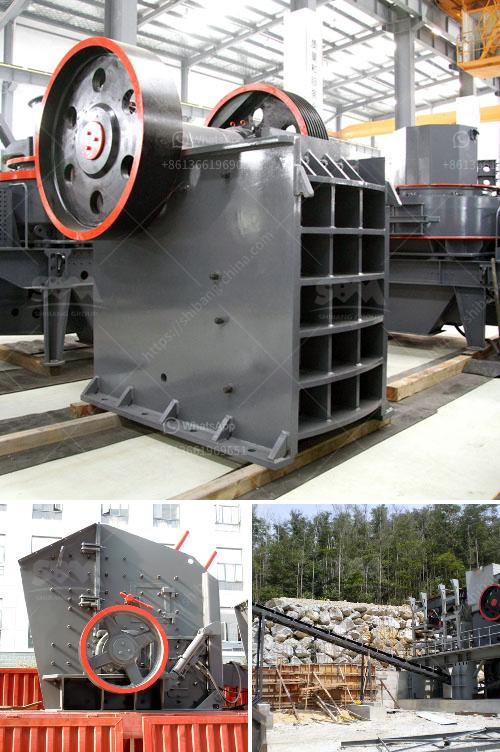

<h3>how much crusher cost</h3>
Having a crusher is often an integral part of any mine or quarry operation. Crushers are capable of breaking down large rocks into more manageable sizes for further processing. However, purchasing a crusher is not just about the initial acquisition cost, but a myriad of factors need to be considered to determine the total cost of ownership. In this article, we will explore the various aspects that contribute to the overall cost associated with owning a crusher.

The initial and most apparent cost of purchasing a crusher would be the price tag. However, this is just the beginning, as one must also consider the cost of running and maintaining the equipment over its operational lifespan. Determining the cost of a crusher entails evaluating its capacity, power consumption, wear parts expenditure, and the expected maintenance schedule.

Capacity is a crucial parameter as it dictates the amount of material that can be processed within a given time frame. Higher capacity crushers are usually more expensive due to their ability to handle greater volumes of material. Additionally, higher capacity crushers often demand a more robust design, which further drives up the cost.

Power consumption is another significant factor impacting the overall cost. The crusher's efficiency in transforming electrical power into mechanical energy plays a vital role in determining power requirements. Energy-efficient crushers may cost more upfront but result in savings on energy bills in the long run.

Wear parts are a recurring expenditure in crushers as they are subjected to intense abrasion and impact forces. The cost of replacing these wear parts must be factored into the overall crusher cost. High-quality wear parts generally demand higher prices, but they also provide a longer lifespan, resulting in fewer replacements and a lower total cost.

Maintenance is an integral aspect of owning any machinery, and crushers are no exception. Regular maintenance helps ensure optimal performance and prolongs the equipment's lifespan. However, it comes at a cost, including labor, spare parts, and potential downtime during maintenance activities. Understanding the expected maintenance schedule and its associated costs is crucial when assessing crusher expenses.

Apart from the direct costs mentioned above, there are indirect costs associated with operating a crusher. These include transportation and installation expenses, obtaining permits and licenses, and complying with environmental regulations. These indirect costs might seem less significant but can add up quickly and significantly impact the overall crusher cost.

To summarize, the cost of a crusher extends beyond the initial purchasing price. It is vital to assess various aspects such as capacity, power consumption, wear parts expenditure, expected maintenance, and indirect costs to accurately determine the true cost of owning a crusher. A thorough evaluation will not only aid in making an informed decision during the purchasing phase but will also assist in managing the crusher efficiently throughout its operational lifespan.
<h3>Contact us</h3><ul><li><strong>Whatsapp:&nbsp;<a href="https://wa.me/8613661969651">+8613661969651</a></strong></li><li><a href="https://swt.shibang-china.com/?git&amp;zhl&amp;how much crusher cost"><strong>Online Service(chat now)</strong></a></li></ul><h3>Related</h3><ul><li><a href='how to make an industrial stone crusher.md'>how to make an industrial stone crusher</a></li><li><a href='grinding raymond dolomite.md'>grinding raymond dolomite</a></li><li><a href='sale stone quarry crusher plant india.md'>sale stone quarry crusher plant india</a></li><li><a href='crusher business aggregate.md'>crusher business aggregate</a></li><li><a href='mini crusher hire johannesburg.md'>mini crusher hire johannesburg</a></li></ul>