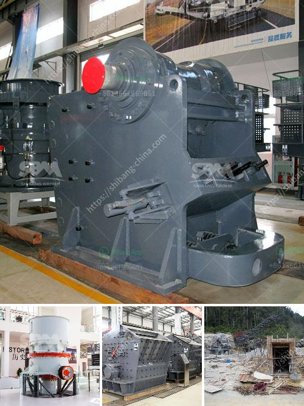

<h3>how much does it cost to open a crusher stone plant</h3>
Opening a crusher stone plant can be a great investment opportunity for new entrepreneurs, as well as seasoned businessmen. The project can be initiated with moderate capital investment and is expected to generate substantial revenue in the future. However, before delving into the costs of opening a crusher stone plant, it is important to understand the different factors that influence the pricing.

One of the first considerations when opening a crusher stone plant is the startup costs. These include expenses for land acquisition, excavation, machinery, and initial working capital. The cost of land and excavation can vary depending on the location and size of the plant. Additionally, machinery costs can range from small portable crushers to large crushing plants.

Another important factor to consider is the cost of raw materials. Crusher stones, also known as aggregates, are typically obtained from quarries, and their availability and prices vary depending on the location. Transportation costs from the quarry to the plant should also be taken into account.

Labor costs are another significant expense in opening a crusher stone plant. The number of employees required will depend on the size and scale of the operation. Skilled labor will be needed for the management and operation of the plant, as well as for maintenance and repairs. Additionally, it may be necessary to hire truck drivers for the transportation of the manufactured stones to customers.

Operational costs are ongoing expenses that need to be considered. These include costs for electricity, water, and fuel consumption. The consumption levels of these resources will depend on the plant's capacity and the amount of material processed. It is essential to estimate these costs accurately to ensure the profitability of the crusher stone plant.

Furthermore, marketing costs should also be taken into account. Promoting the products of the crusher stone plant is crucial for attracting customers and increasing sales. Expenses for advertising, branding, and digital marketing should be incorporated into the overall budget.

In addition to the above expenses, it is advisable to set aside a contingency fund for unforeseen circumstances. This will provide a safety net in case of unexpected repairs, equipment breakdowns, or fluctuations in the market.

The total cost of opening a crusher stone plant can vary significantly depending on all the factors mentioned above. However, a rough estimate for a medium-sized plant with a production capacity of around 200 tons per hour could range from $1 million to $2 million. It is important to note that these figures are just estimations and can vary depending on the specific circumstances.

Despite the initial investment required, opening a crusher stone plant can be a profitable venture. The demand for crusher stones is high, as they are widely used in construction projects, road building, and landscaping. With proper planning and budgeting, entrepreneurs can expect to generate substantial revenue in the long run.
<h3>Contact us</h3><ul><li><strong>Whatsapp:&nbsp;<a href="https://wa.me/8613661969651">+8613661969651</a></strong></li><li><a href="https://swt.shibang-china.com/?git&amp;zhl&amp;how much does it cost to open a crusher stone plant"><strong>Online Service(chat now)</strong></a></li></ul><h3>Related</h3><ul><li><a href='how much is earned in the stone crusher.md'>how much is earned in the stone crusher</a></li><li><a href='small cone crusher for sale za.md'>small cone crusher for sale za</a></li><li><a href='mini crusher hire johannesburg.md'>mini crusher hire johannesburg</a></li><li><a href='bhel coal mill spares manufacturers.md'>bhel coal mill spares manufacturers</a></li><li><a href='bentonite plant system.md'>bentonite plant system</a></li></ul>