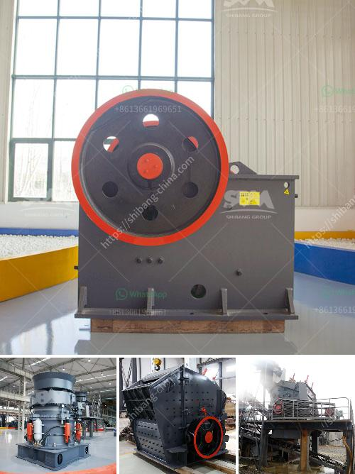

<h3>how much is a crusher</h3>
When it comes to hydraulic rock crushers, the market is flooded with various options, making it challenging to determine the exact price. However, the cost of a crusher depends on several factors, including the type and model, efficiency, brand reputation, and additional features. In this article, we will discuss the approximate prices of crushers, focusing on a range of 300-500 words.

Crushers are used extensively in the mining, construction, and recycling industries to break larger rocks down into smaller, more manageable sizes. They come in various forms, such as jaw crushers, impact crushers, cone crushers, and gyratory crushers. Each type serves a specific purpose and has different price points associated with it.

For instance, if you are looking for a basic jaw crusher, you can expect to spend around $50,000 to $100,000. Prices can vary depending on the brand, size, capacity, and additional features. Jaw crushers are commonly used for primary crushing, making them ideal for applications in quarries, construction sites, and recycling centers.

On the other hand, impact crushers are designed to crush softer materials, such as limestone and recycled concrete. They are often used in the secondary or tertiary crushing stages and range in price from $100,000 to $500,000, depending on the model and specifications.

If you require even more crushing power, cone crushers and gyratory crushers are the go-to options. These machines are known for their high capacity and efficiency but come with a higher price tag. A cone crusher can cost anywhere between $500,000 to $2 million, while a gyratory crusher can cost upwards of $10 million.

Apart from the type and model of the crusher, other factors can influence the price. The brand reputation plays a significant role, as reputable manufacturers often charge a premium for their products. This is because they invest heavily in research, development, and quality control to ensure their crushers are reliable, efficient, and durable.

Additionally, crushers with advanced features such as automation, remote control, and monitoring systems may come at a higher price. While these features add convenience and improve productivity, they also increase the overall cost of the crusher. It is crucial to carefully evaluate your operational needs and budget constraints before deciding on the level of automation and additional features required.

It is worth noting that while the initial purchase price of a crusher is significant, ongoing maintenance and operational costs should also be considered. Regular maintenance, spare parts, and fuel consumption can add up over time. Therefore, it is essential to choose a crusher that strikes a balance between the upfront cost and long-term operational expenses.

In conclusion, the cost of a crusher can vary significantly based on factors such as type, model, brand reputation, and additional features. Understanding your specific needs and budget constraints is crucial in making an informed decision. By carefully evaluating these factors, you can purchase a crusher that offers optimal performance and value for money. Whether you are in the mining, construction, or recycling industry, investing in the right crusher can greatly impact your operational efficiency and profitability.
<h3>Contact us</h3><ul><li><strong>Whatsapp:&nbsp;<a href="https://wa.me/8613661969651">+8613661969651</a></strong></li><li><a href="https://swt.shibang-china.com/?git&amp;zhl&amp;how much is a crusher"><strong>Online Service(chat now)</strong></a></li></ul><h3>Related</h3><ul><li><a href='mobile rock crushers in ghana.md'>mobile rock crushers in ghana</a></li><li><a href='crusher equipment price.md'>crusher equipment price</a></li><li><a href='stone crusher baler.md'>stone crusher baler</a></li><li><a href='tons per year gypsum powder production line.md'>tons per year gypsum powder production line</a></li><li><a href='coal fine pelletizing machine manufacturer india.md'>coal fine pelletizing machine manufacturer india</a></li></ul>