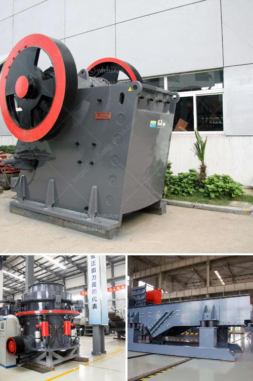

<h3>how much is cost of jaw crusher</h3>
A jaw crusher is one of the primary machines that are used in the mining industry. It helps to break down larger materials into manageable pieces and provides an efficient means of crushing materials. The cost of a jaw crusher can vary depending on the size and the quality of its components. Let's take a closer look at how much a typical jaw crusher costs.

The size of the jaw crusher is an important consideration when purchasing a machine. Jaw crushers are available in different sizes, ranging from small scale portable units to large-scale rock crushers. The choice of jaw crusher size is determined by the size of the materials you will be crushing and the desired output size. Generally, the larger the size of the jaw crusher, the higher the cost.

Another factor that affects the cost of a jaw crusher is the quality of its components. Jaw crushers are made up of several different parts, including the main frame, flywheel, toggle plates, jaw plates, and bearings. Each of these components plays a crucial role in the functionality of the jaw crusher. Higher-quality components are generally more durable and reliable, but they also come with a higher price tag.

In addition to the size and quality of the jaw crusher, there are several other factors that can affect its cost. One of these factors is the type of power source used. Jaw crushers can be powered by electricity, diesel fuel, or hydraulic power. Electric-powered jaw crushers are usually more expensive because of the cost of electricity and the need for an electric generator. Diesel-powered jaw crushers may have a lower upfront cost but can be more expensive in the long run due to the cost of diesel fuel. Hydraulic-powered jaw crushers are the most expensive option but are also the most efficient and require less maintenance.

The cost of a jaw crusher can also be influenced by the capacity or throughput of the machine. Jaw crushers with higher capacities are generally more expensive. However, they can also offer higher productivity and faster processing times, making them a better investment in the long run.

In conclusion, the cost of a jaw crusher depends on various factors such as the size, quality, power source, and capacity of the machine. It is important to consider all these factors when purchasing a jaw crusher to ensure that you get the best value for your money. While a higher upfront cost may seem daunting, investing in a high-quality and efficient jaw crusher can result in significant cost savings in the long term.
<h3>Contact us</h3><ul><li><strong>Whatsapp:&nbsp;<a href="https://wa.me/8613661969651">+8613661969651</a></strong></li><li><a href="https://swt.shibang-china.com/?git&amp;zhl&amp;how much is cost of jaw crusher"><strong>Online Service(chat now)</strong></a></li></ul><h3>Related</h3><ul><li><a href='crusher conveyor belt.md'>crusher conveyor belt</a></li><li><a href='plamnta mobile stone crusher.md'>plamnta mobile stone crusher</a></li><li><a href='conveyor belts in peru.md'>conveyor belts in peru</a></li><li><a href='used crusher plants on sale in uae.md'>used crusher plants on sale in uae</a></li><li><a href='ball mill iran mining.md'>ball mill iran mining</a></li></ul>