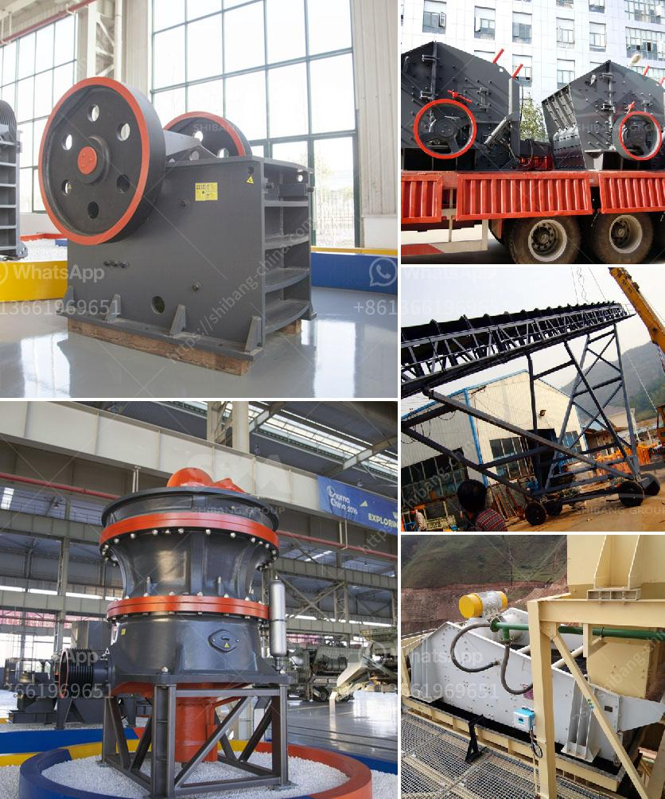

<h3>how much is earned in the stone crusher</h3>
The stone crusher is a piece of indispensable equipment for the stone crushing line. Which can be used for primary, secondary and fine crushing of more than 200 kinds of rough stones such as granite, basalt, limestone, rock, concrete, aggregate, gravel, dolomite and quartz.

In recent years, with the continuous improvement of technology, the stone crusher has advanced by leaps and bounds. It has become a well-known equipment in the market due to its high efficiency, low energy consumption, easy operation, and environmental friendliness.

When it comes to the earnings of the stone crusher, it varies depending on the type, brand, and model of the equipment, as well as the production capacity and efficiency. Let's take a closer look at the factors that influence the earning potential of a stone crusher.

Firstly, the type of stone crusher plays a significant role. There are various types of stone crushers on the market, such as jaw crushers, cone crushers, impact crushers, and hammer crushers. Each type has its own unique features and advantages. For example, jaw crushers are suitable for crushing large-sized stones, cone crushers are best for medium-sized stones, and impact crushers are more suitable for processing smaller rocks.

Secondly, the brand and model of the stone crusher also affect its earnings. With the fierce market competition, different brands have different pricing and quality levels. Famous brands tend to have higher prices but also reliable quality and long service life. Customers are generally willing to pay a higher price for a stone crusher from a reputable brand.

Thirdly, the production capacity and efficiency of the stone crusher greatly influence its earnings. Crushers with high production capacity are able to process a larger amount of stones in a shorter time, which can improve the overall efficiency and increase the earning potential. It's worth noting that the production capacity should match the demand in the local market to optimize the earnings.

Lastly, the operating cost is an essential factor in determining the earnings of a stone crusher. Operating costs include the cost of raw materials, labor cost, electricity cost, maintenance cost, and equipment depreciation. By controlling the operating costs effectively, stone crusher owners can maximize their earnings.

In conclusion, the earning potential of a stone crusher can vary greatly depending on various factors such as the type, brand, model, production capacity, efficiency, and operating costs. It is crucial for stone crusher owners to carefully analyze these factors and make informed decisions to maximize their earnings. With the continuous development of the industry, the stone crusher will continue to play an important role in various construction projects and continue to generate substantial earnings for its owners.
<h3>Contact us</h3><ul><li><strong>Whatsapp:&nbsp;<a href="https://wa.me/8613661969651">+8613661969651</a></strong></li><li><a href="https://swt.shibang-china.com/?git&amp;zhl&amp;how much is earned in the stone crusher"><strong>Online Service(chat now)</strong></a></li></ul><h3>Related</h3><ul><li><a href='stone crusher plant design pdf.md'>stone crusher plant design pdf</a></li><li><a href='high capacity ball mill malaysia.md'>high capacity ball mill malaysia</a></li><li><a href='jaw crusher for sale in auction.md'>jaw crusher for sale in auction</a></li><li><a href='roller mill sahibabad.md'>roller mill sahibabad</a></li><li><a href='feasibility study quartz stone.md'>feasibility study quartz stone</a></li></ul>