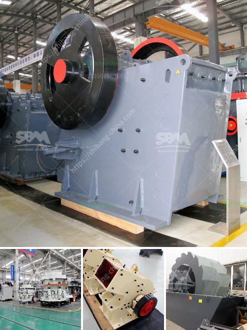

<h3>how much is scm series ultrafine mill machine in usa</h3>
SCM series ultrafine mill machine is a high-efficiency and energy-saving grinding equipment developed by Shanghai Shibang Machinery Co., Ltd. This grinding mill can be used to grind various non-metallic minerals with Mohs hardness below 7 and humidity below 6%, such as limestone, calcite, marble, talc, barite, dolomite, granite, kaolin, bentonite, bauxite, etc. The fineness of the finished product can be adjusted between 325-2500 mesh.

The SCM series ultrafine mill machine has many advantages compared with traditional Raymond mills and ball mills. Firstly, the ultrafine mill has a higher grinding efficiency. With the same fineness of materials and finished products, the output of the SCM ultrafine mill is more than 40% higher than that of the Raymond mill, and the energy consumption is saved by more than 30% compared with the ball mill. Secondly, the grinding mill has a wide range of applications. It not only can be used in the fields of mining, metallurgy, chemical industry, electric power, construction, ceramics, cement, refractory materials, and other industries, but also can be used for the powder processing of various non-flammable and explosive materials such as gypsum, talc, calcite, limestone, marble, potash feldspar, barite, dolomite, granite, kaolin, bentonite, bauxite, etc. Finally, the ultrafine mill has a longer service life. The wearing parts of the grinding mill are made of high-quality wear-resistant materials, which can effectively reduce the wear and tear of the equipment and extend the service life of the machine.

As for the price of the SCM series ultrafine mill machine in the USA, it depends on many factors such as the model, capacity, and configuration of the machine. Generally speaking, the price of the SCM series ultrafine mill machine ranges from thousands to millions of dollars. The specific price can be obtained through market research or inquiry with the manufacturer.

When purchasing the SCM series ultrafine mill machine, it is recommended to consider the following aspects:

1. Identify the grinding materials and the fineness of the finished product required, so as to choose a suitable model and capacity of the machine.

2. Compare the prices of different manufacturers and choose a reliable manufacturer with excellent product quality and after-sales service.

3. Pay attention to the configuration of the machine, including the motor power, transmission system, grinding roller device, grinding ring, etc., to ensure that the equipment can meet the production needs.

In conclusion, the SCM series ultrafine mill machine is an advanced and efficient grinding equipment with high grinding efficiency, wide application range, and long service life. The price of the machine in the USA varies depending on the specific requirements and configurations. It is recommended to conduct market research and choose a reliable manufacturer when purchasing the ultrafine mill machine.
<h3>Contact us</h3><ul><li><strong>Whatsapp:&nbsp;<a href="https://wa.me/8613661969651">+8613661969651</a></strong></li><li><a href="https://swt.shibang-china.com/?git&amp;zhl&amp;how much is scm series ultrafine mill machine in usa"><strong>Online Service(chat now)</strong></a></li></ul><h3>Related</h3><ul><li><a href='hammer mill design drawing pdf.md'>hammer mill design drawing pdf</a></li><li><a href='lm vertical grinding mills.md'>lm vertical grinding mills</a></li><li><a href='ball mill work rules.md'>ball mill work rules</a></li><li><a href='dolomite rock crusher.md'>dolomite rock crusher</a></li><li><a href='kaolin crusher processing machine.md'>kaolin crusher processing machine</a></li></ul>