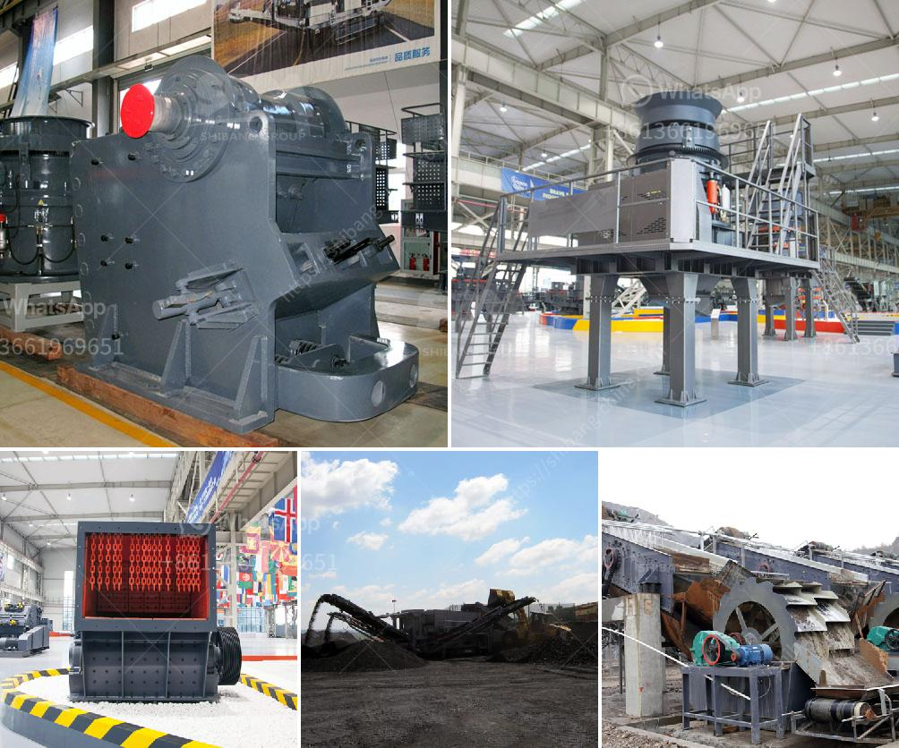

<h3>how to calculate grinding media in cement mill</h3>
Calculating the grinding media in a cement mill is necessary for achieving the desired production efficiency and quality target. However, this can be a challenging task for several reasons. Firstly, the selection and loading of the grinding media must be carefully considered to avoid overloading or underloading the mill. Secondly, the characteristics of the grinding media, such as size, shape, and density, must be taken into account to achieve optimal grinding performance. In this article, we will discuss the steps involved in calculating the grinding media in a cement mill.

The first step in calculating the grinding media is to determine the total quantity of grinding media required for the mill. This can be done by estimating the total load of the mill and then selecting the appropriate grinding media based on their physical properties, such as size and density. The load of the mill primarily depends on the feed material and the desired grinding process. Different grinding processes, such as dry or wet grinding, require different amounts of grinding media.

To estimate the total load of the mill, the bulk density of the grinding media must be determined. The bulk density is the mass of the grinding media divided by its volume. It is measured in grams per cubic centimeter (g/cm³) or kilograms per cubic meter (kg/m³). The bulk density can be determined through laboratory tests or by using manufacturer specifications.

Once the bulk density is known, the total quantity of grinding media can be calculated using the following formula:

The mill volume can be determined by multiplying the cross-sectional area of the mill by its length. The cross-sectional area can be calculated as:

The next step is to select the appropriate grinding media based on their physical properties. The grinding media can be classified into different types, such as steel balls, ceramic balls, or cylpebs. The selection of the grinding media depends on several factors, including the hardness of the material to be ground, the operating conditions of the mill, and the desired final product quality.

The size of the grinding media is also an important consideration. Generally, larger grinding media are used for coarse grinding, while smaller media are used for finer grinding. The size of the grinding media is usually specified by the manufacturer or can be determined using empirical formulas based on the desired final particle size and the mill characteristics.

Finally, once the grinding media quantity and type are determined, they need to be loaded into the mill. The loading of the grinding media must be done carefully to avoid overloading or underloading the mill. Overloading can cause excessive wear on the mill liners and reduced grinding efficiency, while underloading can result in insufficient grinding and lower production rates.

In conclusion, calculating the grinding media in a cement mill is essential for achieving the desired production efficiency and quality target. The total quantity of grinding media can be calculated based on the bulk density and the mill volume. The selection of the grinding media type and size depends on various factors, including the material to be ground, the operating conditions, and the desired final product quality. Loading the grinding media into the mill must be done carefully to ensure optimal grinding performance. By following these steps, the grinding media calculation can be effectively carried out for improved mill operation.
<h3>Contact us</h3><ul><li><strong>Whatsapp:&nbsp;<a href="https://wa.me/8613661969651">+8613661969651</a></strong></li><li><a href="https://swt.shibang-china.com/?git&amp;zhl&amp;how to calculate grinding media in cement mill"><strong>Online Service(chat now)</strong></a></li></ul><h3>Related</h3><ul><li><a href='ouedkniss station concassage.md'>ouedkniss station concassage</a></li><li><a href='vertical mill for slag grinding.md'>vertical mill for slag grinding</a></li><li><a href='stone crusher machinery manufacturers.md'>stone crusher machinery manufacturers</a></li><li><a href='large capacity jaw crusher machines sales to india.md'>large capacity jaw crusher machines sales to india</a></li><li><a href='stone quarry machines in uganda for sale.md'>stone quarry machines in uganda for sale</a></li></ul>