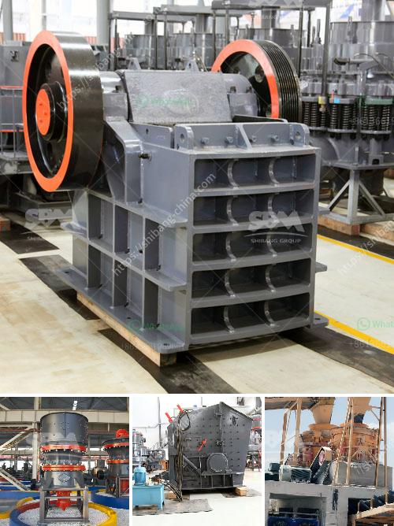

<h3>how to control partials size in vertical hammer mill</h3>
Particle size reduction is a crucial process in many industrial sectors. Whether you are in the food processing, pharmaceutical, or chemical industry, achieving the desired particle size is essential for improving product quality and optimizing production efficiency. One commonly used equipment for particle size reduction is a vertical hammer mill. However, controlling the particle size in this type of equipment can be challenging. In this article, we will explore different methods and techniques for effectively controlling particle size in a vertical hammer mill.

The speed at which the hammers rotate in a vertical hammer mill plays a significant role in determining the particle size. By increasing the speed, the particles will be subjected to more impact and shear forces, resulting in smaller particle sizes. On the other hand, reducing the speed will decrease the impact forces, leading to larger particle sizes. Experimenting with different rotor speeds can help find the optimal setting for achieving the desired particle size.

The configuration of the hammers in a vertical hammer mill can affect the particle size distribution. Hammer designs can vary in terms of size, shape, and spacing. Different configurations can impact the grinding ability of the mill and the resulting particle size. A larger hammer size, for instance, will generally produce a coarser particle size. By experimenting with various hammer configurations, it is possible to optimize the system and achieve the desired particle size range.

Another effective way to control particle size in a vertical hammer mill is by using different screen sizes. The screen acts as a barrier that determines the final particle size of the milled product. Finer screens will allow smaller particles to pass through, resulting in a finer product. Conversely, using coarser screens will keep larger particles inside the mill, producing a coarser product. By changing the screen size, operators can adjust the product particle size to meet specific requirements.

Controlling the feed rate into the vertical hammer mill can influence the particle size distribution. A higher feed rate will result in particles spending less time inside the mill, potentially leading to larger particle sizes. Conversely, reducing the feed rate will result in particles spending more time in the mill, leading to finer particle sizes. Carefully monitoring and adjusting the feed rate can help achieve the desired particle size range.

To further improve particle size control, a classifier can be integrated into the vertical hammer mill system. A classifier separates particles based on their size, allowing for precise control over the particle size distribution. By recycling oversize particles back into the mill, classifiers help achieve a consistent particle size throughout the process.

In conclusion, controlling particle size in a vertical hammer mill is essential for various industries. Experimenting with rotor speed, hammer configuration, screen sizes, and feed rate control can help achieve the desired particle size range. Integrating a classifier into the system can further enhance particle size control. By applying these techniques and optimizing the settings, operators can improve product quality, increase production efficiency, and ultimately enhance their overall operational performance.
<h3>Contact us</h3><ul><li><strong>Whatsapp:&nbsp;<a href="https://wa.me/8613661969651">+8613661969651</a></strong></li><li><a href="https://swt.shibang-china.com/?git&amp;zhl&amp;how to control partials size in vertical hammer mill"><strong>Online Service(chat now)</strong></a></li></ul><h3>Related</h3><ul><li><a href='crushing of calcined bauxite.md'>crushing of calcined bauxite</a></li><li><a href='copper beneficiation.md'>copper beneficiation</a></li><li><a href='crusher conveyor belt.md'>crusher conveyor belt</a></li><li><a href='quarries rock crushing process.md'>quarries rock crushing process</a></li><li><a href='mining equipment chrome concentrate in turkey.md'>mining equipment chrome concentrate in turkey</a></li></ul>