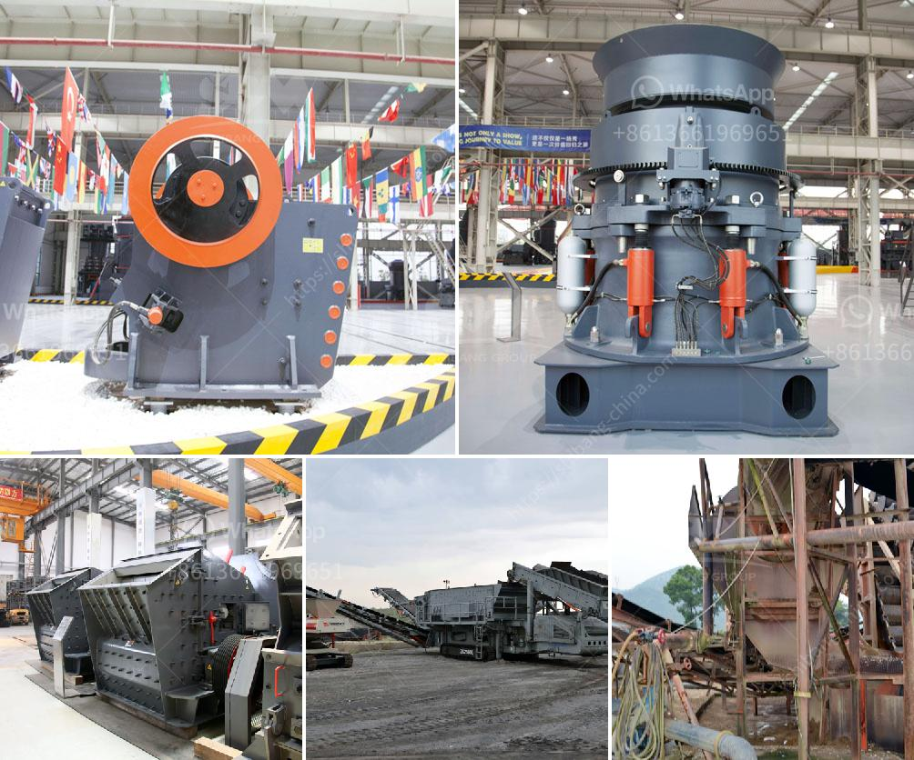

<h3>how to identify rear roll in the two roll mill</h3>
The two roll mill is a vital piece of equipment used in various industries, particularly in the rubber and plastic industries. Its primary purpose is to mix, refine, and blend materials, ensuring their quality and consistency. One crucial aspect of operating a two roll mill is identifying rear roll conditions. Rear roll problems can lead to various issues, including poor product quality, reduced yield, and even downtime. Hence, it is crucial to recognize rear roll conditions promptly to prevent further complications. This article aims to provide guidance on identifying rear roll in the two roll mill.

Before delving into identifying rear roll conditions, it is essential to have a basic understanding of the two roll mill's working principle. The mill consists of two parallel, horizontally placed rolls, commonly referred to as front roll and rear roll. The material being processed is fed between these rolls, which rotate in opposite directions, applying pressure and friction to mix and refine the material. Proper alignment and operation of these rolls are critical for optimal mill performance.

One way to identify rear roll conditions is by closely monitoring the mill's temperature. An imbalance in roll temperature can indicate rear roll problems. Typically, the rear roll's temperature should be slightly higher than the front roll's temperature. If the rear roll temperature is significantly lower than expected, it may indicate inadequate cooling or insufficient pressure exerted by the rear roll.

Another telltale sign of rear roll conditions is uneven pressure distribution across the nip, the narrow gap between the two rolls. During normal operation, both rolls should maintain equal pressure across the nip. However, if there is a significant difference in pressure, it suggests rear roll-related issues. This pressure imbalance can result from misalignment, wear, or even deformation of the rear roll.

Furthermore, inspecting the material's appearance after processing can reveal rear roll conditions. If the material exhibits inconsistent thickness, poor homogeneity, or irregular texture, it may indicate rear roll problems. These issues commonly arise due to improper material flow caused by rear roll misalignment or inadequate pressure exerted.

Vibration is another prominent indicator of rear roll conditions. Excessive vibration during operation is often indicative of rear roll misalignment or wear. This problem can lead to decreased mill efficiency, increased energy consumption, and accelerated roll damage if left unaddressed.

Lastly, conducting routine maintenance and inspections can help identify rear roll conditions before they escalate. Regularly check for signs of wear, such as roll scratches, inconsistencies in roll diameters, or excessive clearance between the rolls. Any abnormal findings should be promptly addressed to prevent rear roll problems.

In conclusion, identifying rear roll conditions is crucial for maintaining optimal performance and productivity in the two roll mill. Monitoring temperature, pressure distribution, material appearance, vibration, and conducting routine inspections are essential steps in identifying rear roll problems promptly. By promptly addressing these issues, manufacturers can prevent poor product quality, reduced yield, and potential downtime. Remember, identifying rear roll conditions is a proactive approach to ensure efficient and reliable two roll mill operation.
<h3>Contact us</h3><ul><li><strong>Whatsapp:&nbsp;<a href="https://wa.me/8613661969651">+8613661969651</a></strong></li><li><a href="https://swt.shibang-china.com/?git&amp;zhl&amp;how to identify rear roll in the two roll mill"><strong>Online Service(chat now)</strong></a></li></ul><h3>Related</h3><ul><li><a href='limestone crushers for sale.md'>limestone crushers for sale</a></li><li><a href='limestone treatment plant.md'>limestone treatment plant</a></li><li><a href='gold recovery process flow diagram pdf.md'>gold recovery process flow diagram pdf</a></li><li><a href='gold mining equipment in south africa for sale.md'>gold mining equipment in south africa for sale</a></li><li><a href='graphite ore buyers in india.md'>graphite ore buyers in india</a></li></ul>