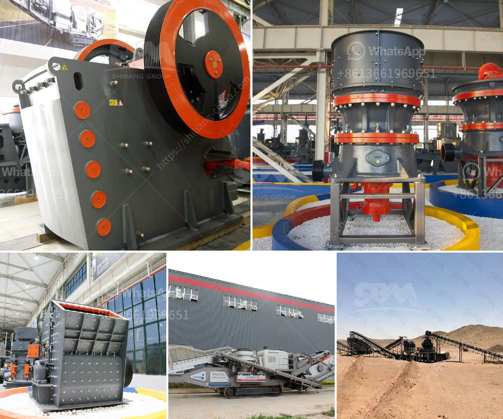

<h3>how to make a stone breaker</h3>
Stones and rocks can be a challenge to break or remove from your garden, construction site, or even a DIY project. However, with the right tools and techniques, you can easily make a stone breaker at home without having to spend a fortune on commercial-grade equipment. Here's a simple guide to help you get started.

1. Safety First: Before you begin, make sure you have the necessary safety gear, such as gloves, safety goggles, and sturdy footwear, to protect yourself from any potential accidents or flying debris.

2. Select Your Materials: To build a stone breaker, you'll need a few key materials, including a metal rod or pipe, a sledgehammer, and a sharpening tool. The metal rod or pipe should be long enough to provide sufficient leverage for breaking the stones effectively.

3. Sharpen the Edge: Using the sharpening tool, carefully sharpen one end of the metal rod or pipe to a point. This point will be the striking surface that will break the stones. Ensure it is sharp enough to penetrate the stones without causing damage to yourself.

4. Prepare the Stones: Before you start breaking the stones, it's best to prepare them by positioning them on a solid and stable surface. If needed, secure the stones in place using a clamp or by burying them slightly in the ground.

5. Break the Stones: Once the stones are in position, hold the metal rod or pipe firmly with both hands. With a swinging motion, strike the pointed end of the rod against the stones. Aim for the center of the stone to deliver maximum force. Repeat this process until the stones break into smaller pieces.

6. Take Breaks and Evaluate: Breaking stones can be physically demanding work, so take regular breaks to prevent fatigue or injury. As you go, evaluate the size of the stones and adjust your technique if needed to break them further into smaller, manageable pieces.

Remember, building a stone breaker at home may not be as powerful or efficient as using heavy-duty equipment, so be patient and take your time. With practice, you'll become more adept at using this homemade tool for breaking stones effectively and saving on costs for your projects.
<h3>Contact us</h3><ul><li><strong>Whatsapp:&nbsp;<a href="https://wa.me/8613661969651">+8613661969651</a></strong></li><li><a href="https://swt.shibang-china.com/?git&amp;zhl&amp;how to make a stone breaker"><strong>Online Service(chat now)</strong></a></li></ul><h3>Related</h3><ul><li><a href='used stone crusher mashines usa.md'>used stone crusher mashines usa</a></li><li><a href='basalt beneficiation process.md'>basalt beneficiation process</a></li><li><a href='sand crusher machine manufacturers.md'>sand crusher machine manufacturers</a></li><li><a href='ball mill ball mill factories.md'>ball mill ball mill factories</a></li><li><a href='conveyor belt machine.md'>conveyor belt machine</a></li></ul>