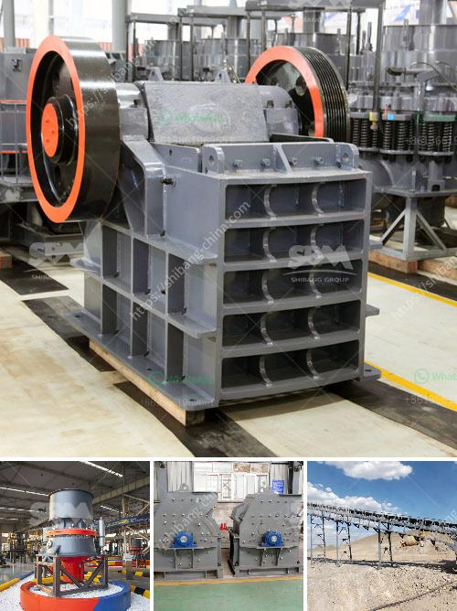

<h3>how to make an industrial stone crusher</h3>
Industrial stone crusher machines are designed for high volume and high efficiency crushing of various stone materials. These machines are often utilized for crushing large stones, rocks, ores, and various minerals into relatively smaller pieces suitable for a wide range of applications.

Industrial stone crushers are the essential machines for construction, mining, and other industries, as they help to reduce the size of large materials and transform them into more manageable sizes. These machines can be used in the production of various materials such as cement, sand, gravel, concrete aggregates, and many more. In this article, we will discuss the steps involved in making an industrial stone crusher.

To begin with, you will need metal sheets, including foundation sheets which will form the base of the machine, side sheets to prevent the stones from escaping during the crushing process, and top sheets to create a housing for the crushing chamber. Additionally, you will need various metal bars, rods, and pipes for the frame and structure of the crusher.

Before starting the construction process, it is essential to have a clear and detailed design sketch of the stone crusher. This will serve as a blueprint for the construction and will make the fabrication process smoother and more efficient. The design should include dimensions, specifications for the required components, and any additional features or functionalities.

Using the design sketch as reference, start fabricating the various components of the stone crusher. Cut the metal sheets, bars, rods, and pipes according to the specifications provided in the design. Ensure that accurate measurements are taken to ensure proper fit and functionality. Depending on the complexity of the design, welding, grinding, and shaping might be required to assemble the parts.

Once all the components are fabricated, the next step is to assemble them together. Begin by welding the foundation sheets to the metal frame to create a stable base for the crusher. Attach the side sheets to the base and secure them firmly. Then, fix the top sheets on the frame to create a housing for the crushing chamber.

Next, install the crushing mechanism inside the housing. The mechanism typically consists of a rotating shaft with hammers or blades attached to it. This shaft is connected to a motor that supplies the required power to rotate the mechanism and crush the stones.

After assembling the stone crusher, it is important to test its functionality and identify any potential issues or areas for improvement. Run the machine with appropriate load and speed to ensure that it functions smoothly and adequately crushes the stones. Make any necessary adjustments to optimize the performance and efficiency of the crusher.

In conclusion, making an industrial stone crusher is a complex task that requires meticulous attention to detail, precise fabrication, and thorough testing. It is important to ensure that the crusher is constructed to withstand harsh operating conditions and is capable of efficiently crushing various stone materials. By following the steps outlined in this article, you can create a robust and efficient industrial stone crusher that will serve your needs in various applications.
<h3>Contact us</h3><ul><li><strong>Whatsapp:&nbsp;<a href="https://wa.me/8613661969651">+8613661969651</a></strong></li><li><a href="https://swt.shibang-china.com/?git&amp;zhl&amp;how to make an industrial stone crusher"><strong>Online Service(chat now)</strong></a></li></ul><h3>Related</h3><ul><li><a href='ball mill manufacturer in inammedabad.md'>ball mill manufacturer in inammedabad</a></li><li><a href='mobile gold refinery for sale.md'>mobile gold refinery for sale</a></li><li><a href='impact crusher for sale in kenya.md'>impact crusher for sale in kenya</a></li><li><a href='mini concrete crusher portable for rent.md'>mini concrete crusher portable for rent</a></li><li><a href='jaw crusher 10 x 36 sulit.md'>jaw crusher 10 x 36 sulit</a></li></ul>