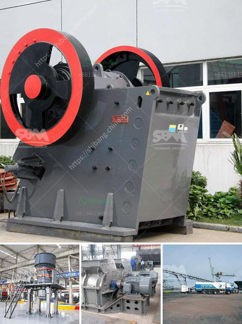

<h3>how to make fly ash</h3>
Fly ash, a byproduct of coal combustion, is gaining significance as a versatile material with a wide range of applications. As an eco-friendly alternative to traditional construction materials, fly ash reduces waste, conserves natural resources, and aids various industries' sustainability efforts. This article aims to provide insights into the process and benefits of creating fly ash, thereby offering a roadmap for its production.

Fly ash is predominantly produced by burning pulverized coal in power plants. To embark on the creation of fly ash, obtaining this crucial raw material is essential. Connect with local power plants and request their permission and assistance in collecting fly ash. Since it is a byproduct, power plants are often eager to offer it at a reasonable cost or even free of charge.

Once obtained, fly ash needs proper storage to ensure quality. Establish an appropriate storage system that prevents the material from coming into contact with water. Fly ash tends to retain moisture, which can negatively impact its properties, making it crucial to keep this material dry.

To ensure the desired quality for your project, it is important to sieve and separate the fly ash. Use a fine sieve to remove any larger particles that may hinder its application. This separation process allows for a finer, more consistent quality of fly ash, ideal for multiple applications.

For certain applications, introducing chemical treatment to the fly ash can enhance its properties and usability. Cement manufacturers, for instance, often employ chemical additives to improve the fly ash's pozzolanic characteristics. However, chemical treatment is not always necessary and should only be considered after thorough research and consultation.

Before proceeding with any application, it is vital to test and verify the quality of the fly ash produced. Samples must be sent to a laboratory for composition analysis, including adequate measurements of key properties such as particle size, fineness, LOI (Loss on Ignition), and chemical composition. This step ensures that the fly ash meets the required industry standards and is suitable for the intended purpose.

Fly ash possesses a multitude of applications across various industries, both in its unprocessed form and after further processing. Some common uses include:

- Construction materials: Fly ash can be blended with Portland cement to produce high-quality concrete with enhanced workability, durability, and reduced CO2 emissions.

- Agriculture and soil amendment: When mixed with soil, fly ash enriches its nutrient content, improves water retention, and helps regulate soil pH levels.

- Waste stabilization: Fly ash has been successfully used in treating and stabilizing waste materials, acting as a binding agent that prevents leaching and protects the environment.

- Manufacturing of bricks and blocks: Fly ash-based bricks are increasingly popular due to their energy-efficiency, low carbon footprint, and superior thermal insulation properties.

Creating fly ash is a sustainable practice that repurposes a byproduct of coal combustion into a versatile material. By following the aforementioned steps, individuals and industries can harness the full potential of fly ash, contributing to environmental conservation and resource optimization. Embracing this eco-friendly innovation positively impacts sustainability efforts across various sectors.
<h3>Contact us</h3><ul><li><strong>Whatsapp:&nbsp;<a href="https://wa.me/8613661969651">+8613661969651</a></strong></li><li><a href="https://swt.shibang-china.com/?git&amp;zhl&amp;how to make fly ash"><strong>Online Service(chat now)</strong></a></li></ul><h3>Related</h3><ul><li><a href='suppliers of crush or rocks pretoria.md'>suppliers of crush or rocks pretoria</a></li><li><a href='crusher price in nepal.md'>crusher price in nepal</a></li><li><a href='rock crusher for excavator.md'>rock crusher for excavator</a></li><li><a href='limestone crushing machine supplier.md'>limestone crushing machine supplier</a></li><li><a href='gold hammer mill used forr sale in zimbabwe.md'>gold hammer mill used forr sale in zimbabwe</a></li></ul>