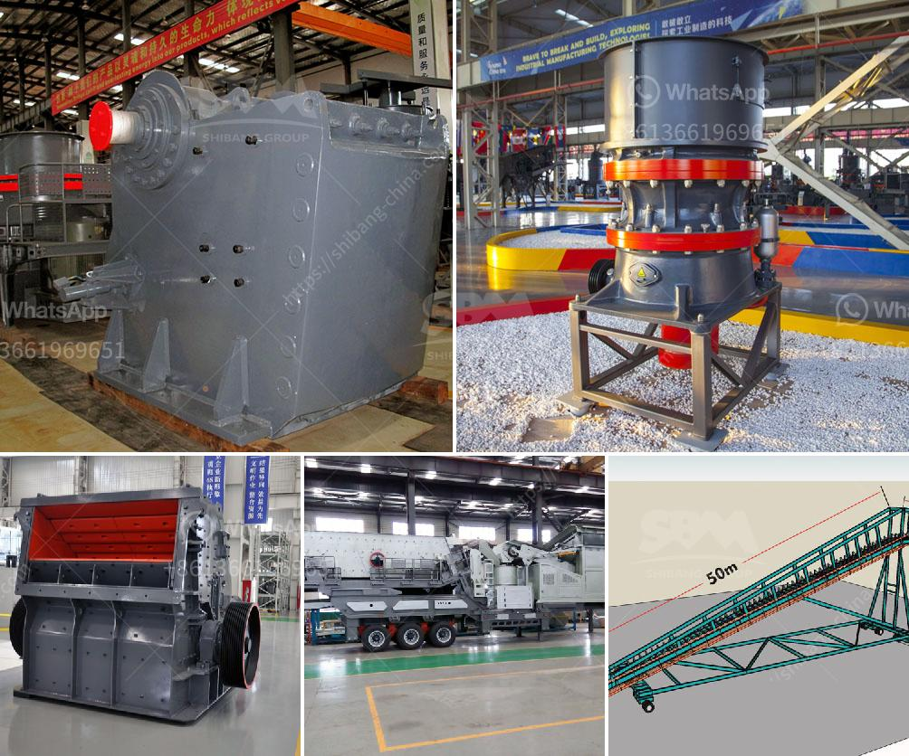

<h3>how to setup a stone quarry</h3>
The process of establishing a stone quarry can be complex, especially when it comes to obtaining the necessary permits, licenses, and regulatory approvals. It’s essential to ensure that the quarry is set up for success and complies with all regulations. In this article, we will provide a step-by-step guide on how to set up a stone quarry.

Before starting, it’s crucial to research the market demand for stones in your area and identify potential customers or clients. Study the competition and assess the supply and demand dynamics. Understanding the market will enable you to make informed decisions and set up your quarry in the right location.

Contact the appropriate regulatory authorities and obtain the necessary permits and licenses required to operate a stone quarry. These may include environmental permits, land-use permits, zoning approvals, and business licenses. Ensure that you comply with all regulations and fulfill any additional requirements specific to your area.

Selecting the right location for your stone quarry is crucial. The site should have ample resources of the desired stone and be easily accessible for transportation and shipping. Consider factors such as proximity to customers, the availability of water sources, and the suitability of the land for excavation.

Design the quarry layout, taking into account various factors such as the size and depth of the quarry, the extraction methods to be employed, and the equipment required for mining and processing. Also, consider how the site will accommodate transportation processes, such as loading and unloading trucks.

Before commencing operations, it’s vital to conduct an environmental impact assessment (EIA) to identify and mitigate any potential environmental impacts. This assessment will help you develop appropriate environmental management plans, ensuring that your quarry operations comply with environmental regulations and minimize their ecological footprint.

Procure the necessary equipment and machinery for your quarry. This may include excavators, loaders, crushing and screening equipment, trucks for transportation, and stone processing machinery. Invest in high-quality, durable equipment that suits the specific needs of your quarry, as it will ensure efficient operations and minimize downtime.

Safety should be your top priority. Develop comprehensive health and safety policies and procedures that follow industry standards. Equip your quarry with safety gear, signage, and regular training sessions for employees. Regular maintenance and inspections should also be carried out to ensure the safety of workers and visitors.

Once your quarry is up and running, develop a marketing and distribution strategy to attract customers and secure contracts. Network with construction companies, architects, landscapers, and other potential clients to promote your stone products. Establish reliable transportation channels to ensure timely and efficient stone delivery to customers.

Setting up a stone quarry requires careful planning and attention to detail. By conducting thorough research, obtaining the necessary permits, designing an effective quarry layout, and implementing safety measures, you can ensure the success and sustainability of your quarry operations. Remember to comply with all safety and environmental regulations and provide a quality product to maintain a competitive edge in the market.
<h3>Contact us</h3><ul><li><strong>Whatsapp:&nbsp;<a href="https://wa.me/8613661969651">+8613661969651</a></strong></li><li><a href="https://swt.shibang-china.com/?git&amp;zhl&amp;how to setup a stone quarry"><strong>Online Service(chat now)</strong></a></li></ul><h3>Related</h3><ul><li><a href='grinding mill price in.md'>grinding mill price in</a></li><li><a href='canada gold mining equipment.md'>canada gold mining equipment</a></li><li><a href='gold hammer mill used forr sale in zimbabwe.md'>gold hammer mill used forr sale in zimbabwe</a></li><li><a href='iron slag crushing ball mill price.md'>iron slag crushing ball mill price</a></li><li><a href='cost of a manganese processing plant in south africa.md'>cost of a manganese processing plant in south africa</a></li></ul>