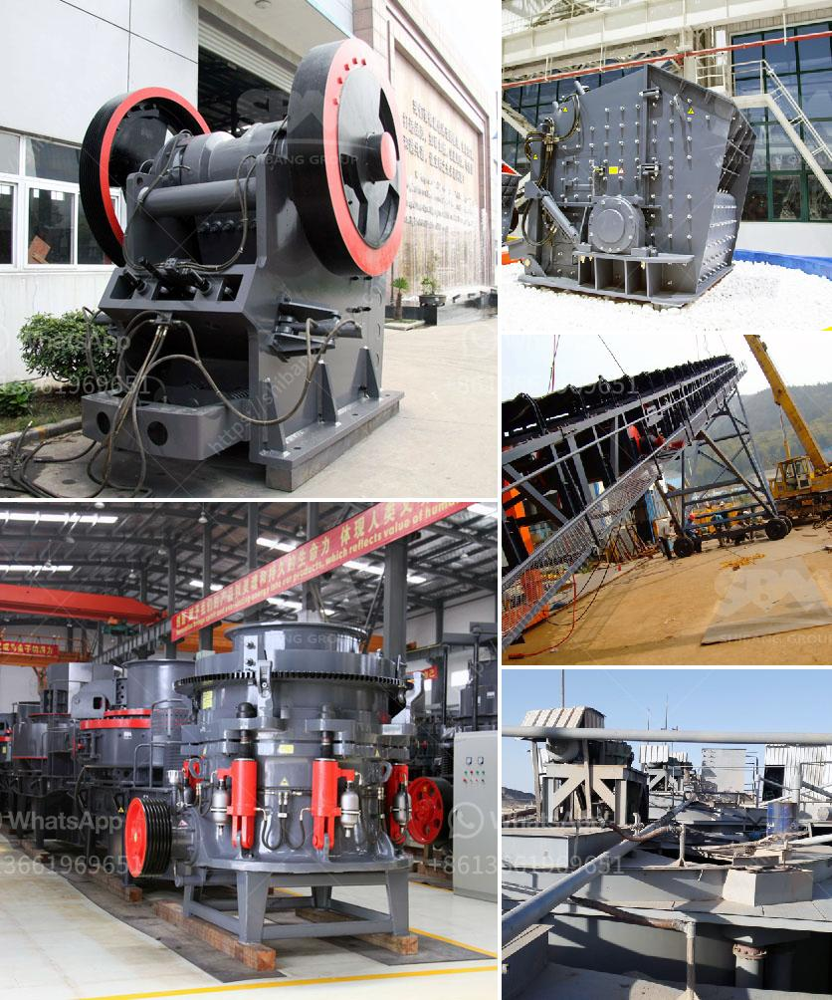

<h3>how to start a cement factory</h3>
Starting a cement factory is a significant undertaking that requires thorough planning and careful execution. Cement is an essential material used in the construction industry, and with the increasing demand for infrastructure development, setting up a cement factory can be a profitable venture. Here are some essential steps to help you kick-start your journey towards establishing a cement factory.

The first step before starting any business is to conduct a comprehensive market research analysis. Identify the supply and demand dynamics in your target location. Study the existing cement manufacturers, their production capacities, and the market trends. Determine if there is sufficient demand to support another cement factory and if there are any untapped opportunities.

A solid business plan is crucial for securing funding, attracting investors, and providing a roadmap for the future. Outline your business objectives, financial projections, marketing strategies, and operational plans. Include information about your raw material sources, production process, distribution channels, and target customers. Seek the input of experts or consultants to ensure the feasibility and viability of your plan.

Establishing a cement factory requires substantial capital investment. Approach banks, financial institutions, or potential investors to secure the necessary funds. Present your business plan in a compelling manner, emphasizing the growth potential, profitability, and risks associated with the venture. Consider approaching governmental agencies that provide grants or loans for industrial development projects.

To ensure legal compliance and smooth operations, obtain all the necessary permits and licenses from local regulatory bodies. This may include environmental clearances, factory licenses, pollution control certificates, labor permits, and tax registrations. Consult with legal professionals to adhere to all legal requirements.

Selecting the right location for your cement factory is crucial for success. Consider factors such as proximity to raw material sources, transportation facilities, availability of utilities like water and electricity, and accessibility to major construction markets. Conduct a cost-benefit analysis to determine the most cost-effective location.

Cement production requires a steady supply of raw materials, primarily limestone, clay, and gypsum. Identify potential sources for these materials and negotiate agreements with suppliers to ensure consistent and reliable supply. Analyze the quality and suitability of raw materials to maintain the desired cement quality.

Invest in modern and efficient machinery and equipment for the cement manufacturing process. This would include crushers, preheaters, kilns, clinker grinders, cement mills, and packing units. Ensure all the equipment is sourced from reputable manufacturers and is in accordance with industry standards.

Hire qualified professionals and skilled workers experienced in cement production. Engage engineers, chemists, production managers, and administrative staff who possess industry knowledge and expertise. Develop a comprehensive training program to effectively train employees and ensure their competence.

Maintain stringent quality control throughout the production process. Set up a well-equipped laboratory to test incoming raw materials, intermediate products, and final cement. Strictly adhere to the international quality standards for cement production, ensuring that a high-quality product is consistently delivered to customers.

Devise an effective marketing plan to build brand visibility and attract customers. Understand customer needs, offer competitive pricing, and provide excellent customer service. Develop strong relationships with construction companies, contractors, and distributors to ensure a reliable distribution network.

Starting a cement factory requires meticulous planning, financial investment, and thorough execution. Follow these steps, be prepared to face challenges along the way, and continuously adapt to the changing market dynamics. With the right strategies in place, your cement factory can thrive in this growing industry.
<h3>Contact us</h3><ul><li><strong>Whatsapp:&nbsp;<a href="https://wa.me/8613661969651">+8613661969651</a></strong></li><li><a href="https://swt.shibang-china.com/?git&amp;zhl&amp;how to start a cement factory"><strong>Online Service(chat now)</strong></a></li></ul><h3>Related</h3><ul><li><a href='gold corporation ball mill.md'>gold corporation ball mill</a></li><li><a href='price conveyor belt.md'>price conveyor belt</a></li><li><a href='basalt crusher supplier.md'>basalt crusher supplier</a></li><li><a href='portable concrete milling machines.md'>portable concrete milling machines</a></li><li><a href='cornerstone equipment inc used rock crushers.md'>cornerstone equipment inc used rock crushers</a></li></ul>