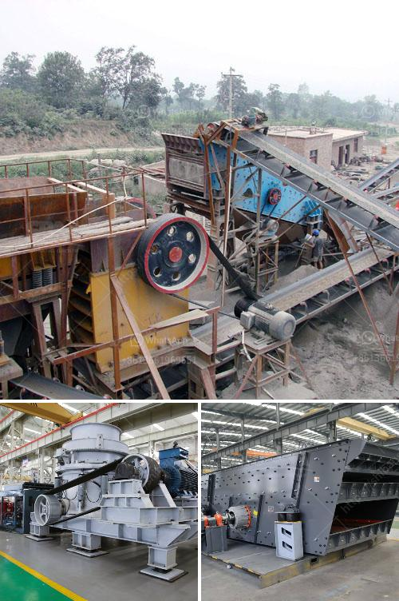

<h3>how vertical roller mill works</h3>
The vertical roller mill is a type of grinding machine for raw material processing and cement grinding in the cement manufacturing process. In recent years, the vertical roller mill has been widely used in the cement industry due to its high efficiency and energy-saving advantages.

The working principle of the vertical roller mill is as follows: the material enters the mill through the feed port and is dropped onto the grinding table. The rotation of the grinding table accelerates the material towards the grinding rollers. As the material passes through the grinding zone, it is crushed by the grinding rollers. The crushed material is then carried upwards by airflows and classified by the classifier.

The grinding rollers, which are in direct contact with the material, apply pressure and shear forces to crush the material. The larger particles are ground by the rollers, while the smaller particles are carriedaway by the airflows and collected by the bag filter system.

The vertical roller mill has several advantages over traditional ball mill systems. It offers the ability to grind materials at a lower energy consumption rate. Moreover, it reduces the maintenance cost and improves the overall production efficiency of cement plants.

Furthermore, the vertical roller mill has a compact design, which saves space and reduces the initial investment cost. It can be easily integrated into existing grinding circuits or installed as a standalone grinding mill.

Overall, the vertical roller mill is a dynamic and efficient grinding solution for the grinding of raw materials and cement clinker. It provides a cost-effective and reliable method for grinding, drying, and classifying raw materials in the cement industry. As the demands for cement continue to increase, the vertical roller mill is expected to become even more popular in the future.
<h3>Contact us</h3><ul><li><strong>Whatsapp:&nbsp;<a href="https://wa.me/8613661969651">+8613661969651</a></strong></li><li><a href="https://swt.shibang-china.com/?git&amp;zhl&amp;how vertical roller mill works"><strong>Online Service(chat now)</strong></a></li></ul><h3>Related</h3><ul><li><a href='track mobile crusher.md'>track mobile crusher</a></li><li><a href='impact crusher machine price.md'>impact crusher machine price</a></li><li><a href='cement grinding mill price invest cost.md'>cement grinding mill price invest cost</a></li><li><a href='screening equipment mining vibrating screen for sale.md'>screening equipment mining vibrating screen for sale</a></li><li><a href='calcium carbide plant and machinery.md'>calcium carbide plant and machinery</a></li></ul>