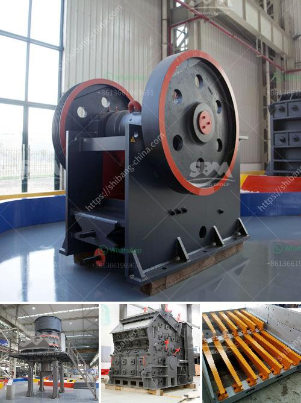

<h3>hydrated lime plant machinery manufacturer</h3>
Lime plays a vital role in various industries, including construction, agriculture, and manufacturing. It is used to improve soil fertility, treat wastewater, and produce building materials. With the increasing demand for lime, the need for efficient and advanced lime production plants has also grown. This is where hydrated lime plant machinery manufacturers come into the picture.

A hydrated lime plant is responsible for transforming quicklime into hydrated lime through a process called hydration. It involves adding water to quicklime, resulting in a fine white powder that is widely used in multiple applications. However, this process requires specialized machinery and expertise to ensure optimal production and quality.

Hydrated lime plant machinery manufacturers are companies that specialize in the design, manufacturing, and installation of lime production equipment. They provide customized solutions that cater to the specific requirements of their clients. These manufacturers have a deep understanding of the lime production process and employ cutting-edge technology to optimize production efficiency and product quality.

The machinery used in hydrated lime plants includes crushers, mills, hydration units, separators, and packing systems. Each of these units is crucial in ensuring a smooth production process and consistent quality. Hydrated lime plant machinery manufacturers ensure that their equipment is of high quality, durable, and operates efficiently, meeting industry standards and regulations.

By choosing a reputable hydrated lime plant machinery manufacturer, companies can benefit in several ways. Firstly, they can enjoy increased production capacity, as the machinery is designed to handle high volumes of lime production. Additionally, these manufacturers focus on energy efficiency, reducing operating costs for businesses. Efficient lime production also leads to reduced waste and improved sustainability.

Furthermore, hydrated lime plant machinery manufacturers offer technical support, maintenance services, and spare parts, ensuring proper functioning of the equipment. These companies have a dedicated team of professionals who can assist with troubleshooting, equipment modifications, and upgrades.

In conclusion, hydrated lime plant machinery manufacturers have revolutionized the lime production industry. Their expertise, advanced machinery, and customized solutions have enabled businesses to meet the growing demand for lime efficiently and sustainably. With their support, companies can streamline their production process, reduce operational costs, and enhance product quality. Choosing the right hydrated lime plant machinery manufacturer is crucial for a successful lime production venture.
<h3>Contact us</h3><ul><li><strong>Whatsapp:&nbsp;<a href="https://wa.me/8613661969651">+8613661969651</a></strong></li><li><a href="https://swt.shibang-china.com/?git&amp;zhl&amp;hydrated lime plant machinery manufacturer"><strong>Online Service(chat now)</strong></a></li></ul><h3>Related</h3><ul><li><a href='granite stone jaw crushers.md'>granite stone jaw crushers</a></li><li><a href='crusher grinder and sieving equipment kaolin.md'>crusher grinder and sieving equipment kaolin</a></li><li><a href='stone grinding mill.md'>stone grinding mill</a></li><li><a href='crushing machine south africa.md'>crushing machine south africa</a></li><li><a href='crusher manufacturing companies in hong kong.md'>crusher manufacturing companies in hong kong</a></li></ul>