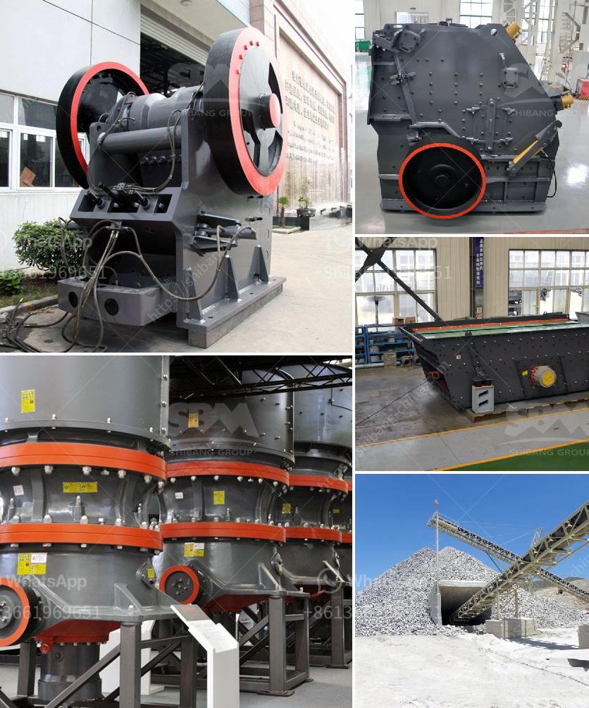

<h3>hydraulic cone crusher application</h3>
The hydraulic cone crusher has been widely used in the mining industry. It is a common equipment for medium and fine crushing of materials. It plays a vital role in the gravel production line and the beneficiation production line.

The working principle of the hydraulic cone crusher is relatively easy to understand. In simple terms, the cone crusher uses a multi-cylinder hydraulic system to provide hydraulic protection and adjustment for the crusher's discharge port. During operation, the motor drives the eccentric sleeve to rotate through the transmission device. The moving cone rotates and swings, allowing the crushing wall to move up and down. When the material is crushed or impacted by the moving cone and the fixed cone, it will be discharged through the discharge port.

1. Gravel production line: The hydraulic cone crusher is a key equipment in the gravel production line. It is used for the medium and fine crushing of various ores and bulk materials. It can crush materials with a compressive strength of not more than 320MPa, such as granite, limestone, and pebbles. The finished product has a uniform particle size and good shape, which meets the high-quality requirements of the construction industry.

2. Beneficiation production line: The hydraulic cone crusher is also an essential equipment in the beneficiation production line. It is suitable for the crushing and shaping of various ore and rock materials, such as iron ore, copper ore, limestone, quartzite, etc. It can crush materials with a Mohs hardness of not more than 9.3 and a humidity of less than 6%. The crushed materials are screened by a vibrating screen and then sent to a ball mill for grinding and beneficiation.

3. Quarrying and mining industry: The hydraulic cone crusher is widely used in the quarrying and mining industry. It can crush various ores and rocks with medium and high hardness, such as basalt, granite, limestone, river pebble, etc. It is an essential equipment in the production and processing of aggregate, concrete, and asphalt.

4. Construction waste disposal: With the rapid development of urban construction, the disposal of construction waste has become an urgent problem. The hydraulic cone crusher can crush and recycle construction waste, turning waste into treasure. It can process construction waste into recycled aggregates, which can be used for road construction, brick making, and other purposes, achieving the recycling and sustainable development of construction waste.

In summary, the hydraulic cone crusher has a wide range of applications. It is a versatile and efficient equipment that can meet the needs of various industries. Whether it is used in the gravel production line, the beneficiation production line, or the construction waste disposal, it can effectively improve the production efficiency and meet the requirements of high-quality products. The hydraulic cone crusher is constantly evolving, with improved performance and higher crushing efficiency, making it an ideal choice for many industries.
<h3>Contact us</h3><ul><li><strong>Whatsapp:&nbsp;<a href="https://wa.me/8613661969651">+8613661969651</a></strong></li><li><a href="https://swt.shibang-china.com/?git&amp;zhl&amp;hydraulic cone crusher application"><strong>Online Service(chat now)</strong></a></li></ul><h3>Related</h3><ul><li><a href='conical ball mill for sale.md'>conical ball mill for sale</a></li><li><a href='used toner powder making machine price.md'>used toner powder making machine price</a></li><li><a href='mining machinery companies in germany.md'>mining machinery companies in germany</a></li><li><a href='complete mining equipment in accra ghana.md'>complete mining equipment in accra ghana</a></li><li><a href='price of stone crusher stone crusher.md'>price of stone crusher stone crusher</a></li></ul>