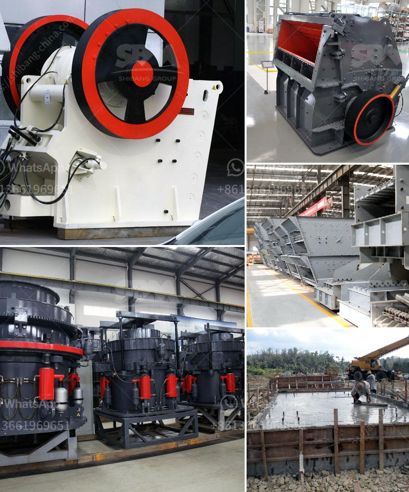

<h3>hydraulic stone crusher for hire uk</h3>
Hydraulic stone crusher is a highly efficient and energy-saving crushing equipment that is developed by our company based on the nature of different stone materials. It combines modern engineering technology with advanced production technology and can be widely used in a variety of stone crushing operations such as highways, railways, infrastructure, building materials, water conservancy, and chemical industries.

The hydraulic stone crusher is highly automated, making it easy to operate and maintain. The equipment is known for its high efficiency and energy-saving performance, further enhancing its popularity. The end product has good grain shape and is suitable for industries such as building materials, water conservancy, and highways. In addition, the hydraulic cone crusher is also a versatile crusher with fully automatic hydraulic adjustment and overload protection. This equipment can not only crush stones, but also iron ore, copper ore, limestone, quartzite, and other materials.

The hydraulic stone crusher is equipped with a variety of features to ensure efficient and safe operation. Users can simply set up the operation mode and load control system, and the equipment will automatically adjust to the best crushing parameters. The overload protection system will ensure that the equipment is not damaged even when encountering non-crushed materials, reducing downtime and maintenance costs.

In the UK, hydraulic stone crusher has been welcomed as one of the most popular crushing equipment. With the development of technology, the performance of hydraulic stone crusher has been continuously improved, and the technology has gradually matured. In recent years, hydraulic stone crusher in the UK has been developed in the direction of large-scale, high-efficiency and environmental protection.

A hydraulic stone crusher for hire uk is a huge investment, so it's important to carefully consider its specifications and features before making a purchase. Although performance and affordability are important factors, maintenance, adaptability, and safety should also be considered.

In conclusion, hydraulic stone crusher for hire uk companies are among the leading suppliers of equipment suitable for a wide range of applications. Available in an array of sizes, they offer users the chance to meet their project requirements with ease. Whether you are in the construction, mining, or any other industry, a hydraulic stone crusher will help you in achieving your objectives efficiently.
<h3>Contact us</h3><ul><li><strong>Whatsapp:&nbsp;<a href="https://wa.me/8613661969651">+8613661969651</a></strong></li><li><a href="https://swt.shibang-china.com/?git&amp;zhl&amp;hydraulic stone crusher for hire uk"><strong>Online Service(chat now)</strong></a></li></ul><h3>Related</h3><ul><li><a href='gypsum chromium limestone mining.md'>gypsum chromium limestone mining</a></li><li><a href='mobile coal cone crusher for hire malaysia.md'>mobile coal cone crusher for hire malaysia</a></li><li><a href='india dolomite grinding machine.md'>india dolomite grinding machine</a></li><li><a href='crushing hpc cone crusher.md'>crushing hpc cone crusher</a></li><li><a href='mini concrete crusher portable for rent.md'>mini concrete crusher portable for rent</a></li></ul>